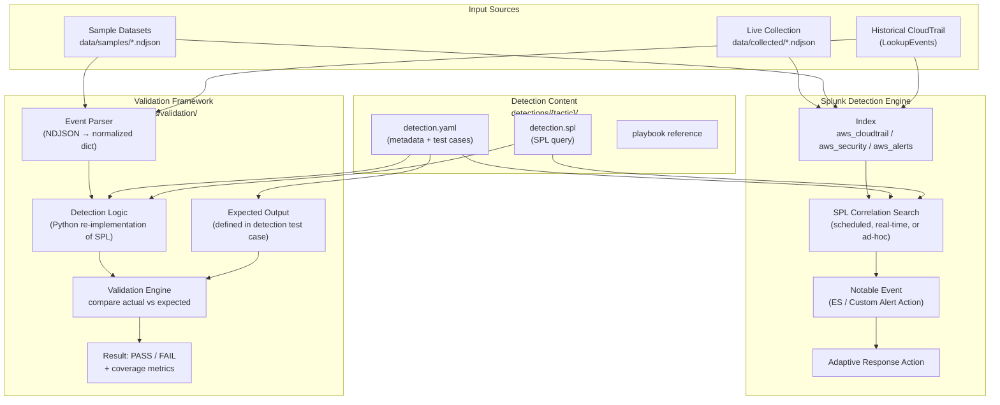
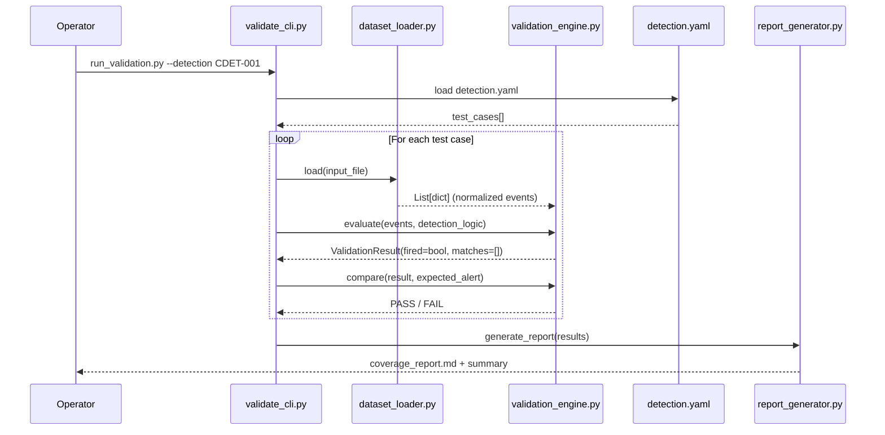

# Detection Architecture

## Overview

This document describes the detection engineering architecture: how detections are structured, how they operate against normalized telemetry, and how the validation framework confirms detection correctness without requiring live attack execution.

---

## Detection-First Design Principle

Detections in this repository are authored and validated independently of attack execution. The validation framework can confirm that a detection fires correctly using:

- **Sample datasets** — Static NDJSON files representing known-malicious CloudTrail events
- **Historical CloudTrail data** — Real events retrieved from AWS via `cloudtrail_collector.py`
- **Future attack simulation output** — NDJSON files produced when a privileged operator executes attack simulations

This separation means:
- Detection authors do not need attack permissions
- CI/CD pipelines can validate detections automatically
- Detection coverage is measurable before any attack is executed

---

## Detection Pipeline



---

## Detection File Structure

Each detection lives in a tactic-named subdirectory under `detections/`. Every detection is a self-contained directory with a consistent structure:

```
detections/
└── {tactic}/
    └── {detection_id}_{short_name}/
        ├── detection.yaml      ← authoritative metadata + test cases
        ├── detection.spl       ← SPL query (imports macros by name)
        └── README.md           ← human-readable summary
```

### detection.yaml Schema

```yaml
id: CDET-001
name: "IAM User Created Outside Approved Pipeline"
version: "1.0.0"
status: active              # active | testing | deprecated
created: "2024-01-15"
modified: "2024-01-15"
author: "Detection Engineering"

# MITRE ATT&CK
tactic: Persistence
technique: "T1136.003"
technique_name: "Create Account: Cloud Account"

# Severity
severity: high
confidence: medium

# Data requirements
data_sources:
  - cloudtrail
required_fields:
  - eventName
  - userIdentity.type
  - userIdentity.arn
  - sourceIPAddress

# SPL reference
spl_file: detection.spl
splunk_index: aws_cloudtrail
splunk_sourcetype: "aws:cloudtrail:normalized"
schedule: "*/15 * * * *"    # cron expression

# Tuning
false_positive_notes: |
  Automated IAM provisioning pipelines (e.g., Terraform, CDK) will trigger this
  detection. Add the pipeline role ARN to the approved_iam_principals lookup.
suppression_fields:
  - userIdentity.arn

# Test cases
test_cases:
  - name: "CreateUser via console by unknown principal"
    input_file: "data/samples/cloudtrail_iam_createuser.ndjson"
    expected_alert: true
    expected_severity: high
  - name: "CreateUser via approved pipeline role"
    input_file: "data/samples/cloudtrail_pipeline_createuser.ndjson"
    expected_alert: false

# Response
playbook: "incident_response/playbooks/iam_account_creation.md"
response_actions:
  - type: splunk_adaptive_response
    action: "run_script"
    script: "automation/response_actions/notify_security_team.py"
```

### detection.spl Format

SPL queries reference macros defined in `splunk/macros/` and lookups in `splunk/lookups/`. Queries must be self-contained within the macro system.

```spl
`aws_cloudtrail_index`
eventName=CreateUser
| eval principal_arn=mvindex('userIdentity.arn', 0)
| lookup approved_iam_principals arn AS principal_arn OUTPUT approved
| where isnull(approved) OR approved!="true"
| eval severity="high", tactic="Persistence", technique="T1136.003"
| table _time, eventName, principal_arn, sourceIPAddress, awsRegion, severity
```

---

## Detection Validation Framework

The validation framework lives in `scripts/validation/`. It provides a programmatic interface for testing whether a detection fires correctly against a given input dataset.

### Validation Flow



### ValidationResult Schema

```python
@dataclass
class ValidationResult:
    detection_id: str
    test_case_name: str
    status: Literal["PASS", "FAIL", "ERROR"]
    expected_alert: bool
    actual_alert: bool
    matched_events: list[dict]
    error_message: str | None
    duration_ms: float
```

### Coverage Report Output

The validation engine produces two outputs:

**1. Per-detection results** (`data/validation_results/{detection_id}_{timestamp}.json`):
```json
{
  "detection_id": "CDET-001",
  "run_at": "2024-01-15T10:30:00Z",
  "test_cases": [
    {
      "name": "CreateUser via console by unknown principal",
      "status": "PASS",
      "expected_alert": true,
      "actual_alert": true,
      "matched_events": 1
    }
  ],
  "overall_status": "PASS"
}
```

**2. Coverage matrix** (`docs/detection_coverage/coverage_matrix.md`): Updated after each full validation run showing which detections have passing tests.

---

## Detection Lifecycle States

| State | Meaning | CI Behavior |
|-------|---------|-------------|
| `draft` | Under development; test cases not yet written | Excluded from CI |
| `testing` | Test cases written; validation in progress | CI runs but failures are non-blocking |
| `active` | Passes all test cases; deployed to Splunk | CI failures block merge |
| `deprecated` | Replaced or retired; kept for reference | Excluded from CI |

---

## Detection Naming Convention

Detection IDs follow the format: `CDET-{NNN}`

- `C` — Cloud detection (distinguishes from endpoint or network detections)
- `DET` — Detection
- `NNN` — Zero-padded three-digit sequence number (001–999)

Detection directory names follow: `{detection_id}_{snake_case_short_name}`

Example: `CDET-001_iam_user_created_outside_pipeline`

---

## SPL Macro Architecture

All detection SPL queries reference macros rather than hardcoded index names or field values. This allows index names and field mappings to be updated in one place.

Core macros defined in `splunk/macros/`:

| Macro | Expands To |
|-------|-----------|
| `` `aws_cloudtrail_index` `` | `index=aws_cloudtrail` |
| `` `aws_security_index` `` | `index=aws_security` |
| `` `aws_alerts_index` `` | `index=aws_alerts` |
| `` `cloudtrail_event(X)` `` | `eventName=X sourcetype=aws:cloudtrail:normalized` |
| `` `iam_event` `` | `eventSource=iam.amazonaws.com` |
| `` `root_activity` `` | `userIdentity.type=Root` |

---

## Detection Coverage Tiers

Coverage is tracked across three tiers aligned to the MITRE ATT&CK framework:

| Tier | Description | Target |
|------|-------------|--------|
| Tier 1 — Core | Detections for the highest-priority TTPs targeting AWS environments | All active |
| Tier 2 — Extended | Detections for moderate-risk TTPs with higher false-positive rates | Active with tuning notes |
| Tier 3 — Hunting | Searches that surface low-signal behaviors for analyst review | Hunting queries, not alerts |

See `docs/detection_coverage/coverage_matrix.md` for the current state of all planned and active detections.
