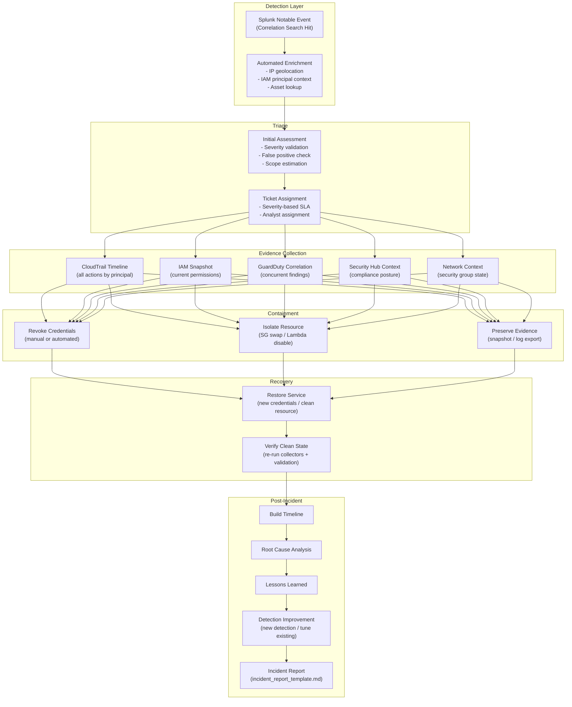

# Incident Response Architecture

## Overview

This document describes how the detection program transitions from an alert into a structured investigation, containment, and recovery workflow. The incident response architecture connects Splunk detection output to documented playbooks, automated response actions, and a repeatable investigation methodology.

---

## Incident Response Workflow



---

## Severity and SLA Framework

Incident severity is set at alert creation time based on the detection's configured severity and enrichment context. SLAs govern response time expectations.

| Severity | Initial Response | Containment Target | Example Detections |
|----------|-----------------|-------------------|--------------------|
| Critical | 15 minutes | 1 hour | Root account activity, CloudTrail disabled, mass credential exposure |
| High | 1 hour | 4 hours | Privilege escalation, new admin user, IAM key from unexpected geo |
| Medium | 4 hours | 24 hours | AssumeRole chain, security group public exposure, GuardDuty HIGH finding |
| Low | 24 hours | 72 hours | Unusual API enumeration, GuardDuty MEDIUM finding, policy drift |

---

## Playbook Structure

Each detection maps to a playbook in `incident_response/playbooks/`. Playbooks are structured documents that guide analysts through investigation and response steps. They do not require memorization — they should be executable by any analyst with read access to the AWS environment.

### Playbook File Naming

```
incident_response/playbooks/{detection_id}_{short_name}.md
```

Example: `incident_response/playbooks/CDET-005_cloudtrail_disabled.md`

### Playbook Sections

Every playbook contains the following sections:

1. **Detection Summary** — What fired and why it matters
2. **Triage Checklist** — Steps to confirm or dismiss as false positive
3. **Investigation Queries** — Ready-to-run CloudTrail SPL and AWS CLI commands
4. **Containment Actions** — Step-by-step containment procedures (manual and automated)
5. **Evidence Preservation** — What to capture before containment modifies state
6. **Recovery Steps** — How to restore normal operations
7. **Escalation Criteria** — When to escalate to senior staff or external counsel
8. **Reporting Obligations** — Regulatory or organizational notification requirements
9. **Lessons Learned Prompts** — Questions to drive post-incident review

See `templates/playbook_template.md` for the authoritative template.

---

## Automated Response Actions

Where speed matters and the action is reversible, automated response can be triggered via Splunk Adaptive Response Actions. All automated actions default to `dry_run: true` in the lab configuration and must be explicitly enabled.

| Action | Trigger Condition | Implementation | Reversible |
|--------|------------------|----------------|-----------|
| Notify security team | Any HIGH/CRITICAL alert | SNS notification | N/A |
| Revoke IAM session | Confirmed credential compromise | Lambda → `iam:DeleteAccessKey` | No (new key required) |
| Isolate EC2 instance | Confirmed command & control activity | Lambda → `ec2:ModifyInstanceAttribute` (SG swap) | Yes (restore original SG) |
| Disable Lambda function | Confirmed malicious execution | Lambda → `lambda:PutFunctionConcurrency(0)` | Yes (restore concurrency) |
| Export CloudTrail logs | Evidence preservation | Lambda → S3 copy to evidence bucket | N/A |

Automated response functions are implemented in `automation/lambda/` and `automation/response_actions/`.

**Critical constraint:** Automated containment actions require elevated AWS permissions not available in the read-only collection role. The response role (`SecurityResponseRole`) is a separate IAM role assumed only at containment time via a separate set of credentials. Collection and response credentials are never mixed.

---

## Evidence Collection Guide

When investigating a potential incident, collect the following evidence before any containment action that might destroy state:

### CloudTrail Timeline

Retrieve all CloudTrail events for the affected principal over the investigation window:

```bash
# Via CLI
python -m scripts.aws_collectors.collect_cli --collector cloudtrail \
  --region us-east-1 --lookback-hours 72 --output-dir data/investigation/

# Via Splunk SPL
index=aws_cloudtrail userIdentity.arn="arn:aws:iam::123456789012:user/alice"
| sort _time
| table _time, eventName, sourceIPAddress, awsRegion, errorCode
```

### IAM Snapshot

Capture the current IAM state for the affected principal:

```bash
python -m scripts.aws_collectors.collect_cli --collector iam \
  --region us-east-1 --output-dir data/investigation/
```

### GuardDuty Correlation

Check for concurrent GuardDuty findings that may indicate wider compromise:

```bash
python -m scripts.aws_collectors.collect_cli --collector guardduty \
  --region us-east-1 --output-dir data/investigation/
```

---

## Incident Report Requirements

All closed incidents must produce an incident report using `templates/incident_report_template.md`. Reports are stored in `incident_response/reports/{YYYY-MM-DD}_{incident_id}.md`.

Minimum required sections:
- Incident summary (one paragraph)
- Timeline of events (chronological)
- Detection trigger and evidence
- Scope of impact
- Containment and recovery actions taken
- Root cause
- Recommendations to prevent recurrence
- Detection improvement action items
