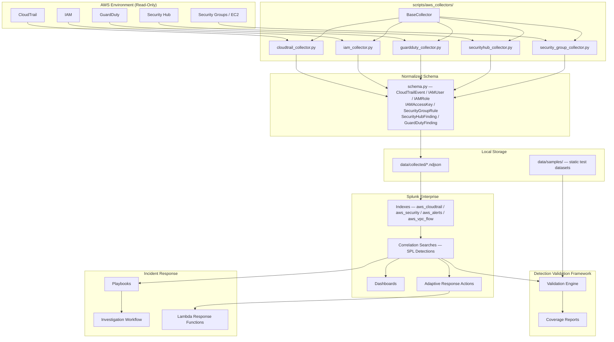

# Solution Architecture

## Overview

The Cloud Threat Detection & Response Lab implements an end-to-end cloud security monitoring program against a live AWS environment. The system collects real security telemetry using read-only APIs, normalizes that telemetry into a common schema, forwards it to Splunk for detection and investigation, and validates detection logic independently of attack execution.

The architecture is built around four core principles:

1. **Detection-first** — Detection content and validation are fully implemented and can be tested without live attack execution.
2. **Read-only collection** — All AWS telemetry is gathered using the minimum required permissions. No write or destructive operations are performed by any collector.
3. **Credential safety** — AWS credentials are never hardcoded, embedded in environment variables, or committed to version control. All Python components use `boto3.Session()` which resolves credentials from the local AWS configuration (`aws configure`).
4. **Schema normalization** — Raw API responses are normalized into typed Python dataclasses before any detection or validation logic consumes them, ensuring consistent field access across all data sources.

---

## System Components



---

## AWS Telemetry Sources

| Source | Collector | API Used | Permission Required | Output Schema |
|--------|-----------|----------|---------------------|---------------|
| CloudTrail | `cloudtrail_collector.py` | `cloudtrail:LookupEvents` | SecurityAudit (read-only) | `CloudTrailEvent` |
| IAM | `iam_collector.py` | `iam:List*`, `iam:Get*` | SecurityAudit (read-only) | `IAMUser`, `IAMRole`, `IAMAccessKey` |
| GuardDuty | `guardduty_collector.py` | `guardduty:ListDetectors`, `ListFindings`, `GetFindings` | SecurityAudit (read-only) | `GuardDutyFinding` |
| Security Hub | `securityhub_collector.py` | `securityhub:GetFindings` | SecurityAudit (read-only) | `SecurityHubFinding` |
| EC2 / VPC | `security_group_collector.py` | `ec2:DescribeSecurityGroups` | SecurityAudit (read-only) | `SecurityGroupRule` |

---

## Credential Model

All Python components instantiate `boto3.Session()` without any explicit credential parameters:

```python
self._session = boto3.Session(region_name=region)
```

Credentials are resolved in boto3's standard precedence order:

1. Environment variables (not used by this project by policy)
2. AWS credentials file (`~/.aws/credentials`) populated by `aws configure`
3. AWS config file (`~/.aws/config`)
4. IAM instance profile (when running on EC2 or Lambda)
5. ECS task role / EKS service account

For local development, credentials are configured once with:

```bash
aws configure
```

The minimum required AWS managed policy is **SecurityAudit** (read-only). No write permissions are required for any collection or validation workflow.

---

## Data Flow Summary

```
1. Operator runs: python -m scripts.aws_collectors.collect_cli --all --region us-east-1
2. BaseCollector creates a boto3.Session() — credentials from aws configure
3. Each collector calls read-only AWS APIs and yields normalized dataclass instances
4. BaseCollector serializes dataclasses to NDJSON in data/collected/
5. NDJSON files are ingested into Splunk via the Splunk Add-on for AWS or direct file monitoring
6. SPL correlation searches in Splunk execute against indexed events
7. Detection hits generate Notable Events and trigger Adaptive Response Actions
8. Validation engine replays events against detection logic to produce pass/fail results
9. Coverage reports map validated detections to the MITRE ATT&CK framework
```

---

## Deployment Topology

```
┌──────────────────────────────────────────────────────────────┐
│  Operator Workstation                                         │
│                                                              │
│  ┌─────────────────────────────────────────────────────┐    │
│  │  CloudThreatDetectionLab/                            │    │
│  │  ├── scripts/aws_collectors/  ← collection layer    │    │
│  │  ├── data/collected/          ← NDJSON output        │    │
│  │  ├── detections/              ← SPL content          │    │
│  │  └── scripts/validation/      ← validation engine   │    │
│  └───────────────────────────────────┬─────────────────┘    │
│                   AWS SDK (boto3)     │  Splunk REST API      │
└──────────────────────────────────────┼──────────────────────┘
                                       │
          ┌────────────────────────────┼────────────────────┐
          │  AWS Environment           │                    │
          │  (read-only access)        │                    │
          │  CloudTrail / IAM /        │                    │
          │  GuardDuty / SecurityHub   │                    │
          └────────────────────────────┘
                                       │
          ┌────────────────────────────┼────────────────────┐
          │  Splunk Enterprise         │                    │
          │  Indexes / Detections /    │                    │
          │  Dashboards / Alerts       │                    │
          └────────────────────────────────────────────────┘
```

---

## Security Design Decisions

| Decision | Rationale |
|----------|-----------|
| Read-only AWS permissions | Collectors cannot modify the environment they are monitoring. Prevents accidental state changes. |
| boto3 default credential chain | No credentials in source code or configuration files. Operator controls credential lifetime via AWS CLI. |
| NDJSON output format | Line-delimited JSON is directly ingestible by Splunk, Elastic, and other SIEMs with no parsing overhead. |
| Typed dataclass schema | Enforces field contracts at collection time rather than at query time. Downstream detection logic can trust field presence and type. |
| Detection-first architecture | Detections can be authored, tested, and validated without running attacks. Attack simulation is additive, not a dependency. |
| Structured logging (structlog) | Machine-readable logs enable collector runs to be audited and debugged without grep. |
