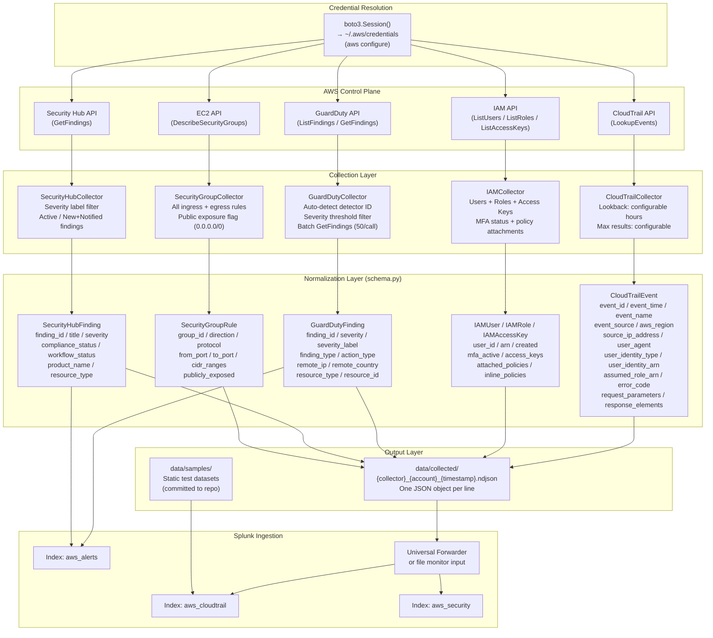

# Telemetry Flow Architecture

## Overview

This document describes the end-to-end flow of security telemetry from AWS source services through collection, normalization, storage, and ingestion into Splunk. Each stage is designed to be independently testable and replaceable.

---

## End-to-End Telemetry Flow



---

## Collection Layer Detail

### CloudTrail Collector

**Purpose:** Retrieve management-plane API activity for detection of IAM abuse, defense evasion, and lateral movement.

**API method:** `cloudtrail:LookupEvents` (paginated, 50 events per page)

**Configurable parameters:**
- `lookback_hours` — how far back to retrieve events (default: 24)
- `max_results` — cap on total events returned (default: 1000)

**Key fields extracted:**
- `userIdentity` block — principal type, ARN, account ID, session issuer (for assumed roles)
- `sourceIPAddress` — originating IP for geo-anomaly detection
- `errorCode` / `errorMessage` — failed API calls indicating enumeration or access denial
- `requestParameters` / `responseElements` — resource-level detail for detections

**High-value event filter:** The collector tracks a curated set of security-relevant API calls including `CreateUser`, `AssumeRole`, `StopLogging`, `DeleteTrail`, `AttachRolePolicy`, and `ConsoleLogin`. All events are collected and normalized; downstream SPL queries apply additional filtering.

---

### IAM Collector

**Purpose:** Enumerate the IAM configuration for baseline posture assessment and detection of new or anomalous principals.

**APIs used:**
- `iam:ListUsers` → `iam:ListAccessKeys` → `iam:GetAccessKeyLastUsed`
- `iam:ListMFADevices` (MFA status per user)
- `iam:ListAttachedUserPolicies` / `iam:ListUserPolicies` (effective policy surface)
- `iam:ListGroupsForUser`
- `iam:ListRoles` → `iam:ListAttachedRolePolicies` / `iam:ListRolePolicies`

**Output types:** `IAMUser`, `IAMRole`, `IAMAccessKey` — all yielded from a single `collect()` call. Consumers filter by `isinstance()`.

**Detection use cases:** Users without MFA, access keys older than policy thresholds, roles with overly permissive trust policies, admin policy attachments.

---

### GuardDuty Collector

**Purpose:** Retrieve ML-generated threat findings for enrichment and correlation with CloudTrail detections.

**APIs used:**
- `guardduty:ListDetectors` — auto-discovers the active detector ID
- `guardduty:ListFindings` — filtered by severity score and `service.archived == false`
- `guardduty:GetFindings` — batched at 50 IDs per call (API limit)

**Severity filtering:** Configurable `severity_threshold` (default: 4.0, i.e. MEDIUM and above on GuardDuty's 1–10 scale).

**Key enrichments normalized:** `action_type`, `remote_ip_address`, `remote_country_code`, `threat_intelligence_details`, `resource_type`, `resource_id`.

---

### Security Hub Collector

**Purpose:** Aggregate cross-service compliance findings and control failures for security posture tracking.

**API used:** `securityhub:GetFindings` — filtered to `RecordState: ACTIVE` and `WorkflowStatus: NEW|NOTIFIED`.

**Severity filter:** Configurable list of severity labels (default: CRITICAL, HIGH, MEDIUM).

**Graceful degradation:** Returns an empty result set with a warning log when Security Hub is not enabled in the target region — does not raise an exception.

---

### Security Group Collector

**Purpose:** Enumerate network exposure to identify publicly accessible resources.

**API used:** `ec2:DescribeSecurityGroups` (paginated)

**Public exposure logic:** A rule is flagged as `publicly_exposed = True` if any CIDR range is `0.0.0.0/0` (IPv4) or `::/0` (IPv6).

**Output:** One `SecurityGroupRule` per permission entry (inbound and outbound rules are separate records with a `direction` field).

---

## Normalization Contract

All collectors write output through `BaseCollector.run()`, which calls `dataclasses.asdict()` on each yielded schema object. This guarantees:

- Field names are stable and snake_case across all sources
- `datetime` objects are serialized to ISO 8601 strings
- Missing optional fields default to `None` (never absent)
- The `raw` field on each schema preserves the original API response for edge-case debugging

The NDJSON output file naming convention is:

```
{collector_name}_{aws_account_id}_{YYYYMMDDTHHMMSSZ}.ndjson
```

Example:
```
cloudtrail_123456789012_20240115T103000Z.ndjson
```

---

## Splunk Ingestion

NDJSON files in `data/collected/` are ingested into Splunk via one of two methods:

**Method 1 — Universal Forwarder file monitor** (preferred for ongoing collection):
```
[monitor://path/to/data/collected/*.ndjson]
sourcetype = aws:cloudtrail:normalized
index = aws_cloudtrail
```

**Method 2 — One-time upload** (for sample datasets):
```bash
python scripts/splunk_ops/upload_events.py --file data/collected/cloudtrail_*.ndjson --index aws_cloudtrail
```

Each source maps to a specific Splunk index:

| Collector | Splunk Index | Sourcetype |
|-----------|-------------|------------|
| cloudtrail | `aws_cloudtrail` | `aws:cloudtrail:normalized` |
| iam | `aws_security` | `aws:iam:normalized` |
| security_groups | `aws_security` | `aws:ec2:securitygroup:normalized` |
| securityhub | `aws_alerts` | `aws:securityhub:finding` |
| guardduty | `aws_alerts` | `aws:guardduty:finding` |

---

## Sample Dataset Strategy

Static sample datasets in `data/samples/` serve two purposes:

1. **Offline development** — Authors can write and test SPL detections without a live AWS connection.
2. **Validation baseline** — The detection validation framework uses sample datasets as deterministic inputs with known-good expected outputs.

Sample files follow the same NDJSON format as live collection output. They are committed to the repository and may include synthetic or anonymized events representing adversary TTPs.

See `docs/architecture/detection_architecture.md` for how sample datasets integrate with the validation framework.
