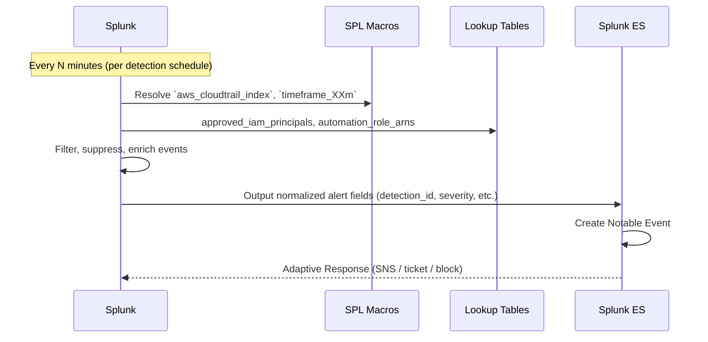
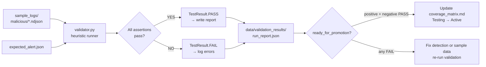
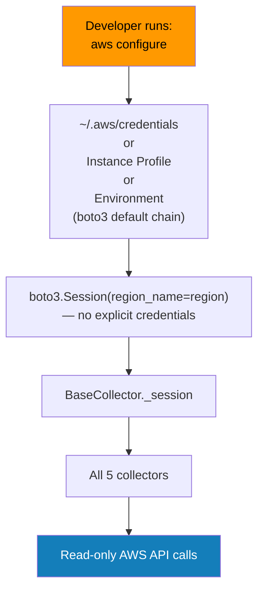

# Telemetry Pipeline Architecture

## Overview

This document describes the end-to-end flow from AWS API activity through detection and alert validation. The pipeline is designed to function with read-only AWS credentials and to support both live collection and replay of sample datasets.

---

## Full Pipeline Diagram

```mermaid
flowchart TD
    subgraph AWS["AWS Environment (read-only access)"]
        A1[EC2 / IAM / STS / S3 API calls]
        A2[CloudTrail — management & data events]
        A3[GuardDuty — threat findings]
        A4[Security Hub — compliance findings]
        A5[CloudWatch — metrics & alarms]
    end

    subgraph Collectors["scripts/aws_collectors/ (boto3.Session)"]
        C1[cloudtrail_collector.py]
        C2[iam_collector.py]
        C3[guardduty_collector.py]
        C4[securityhub_collector.py]
        C5[security_group_collector.py]
        C6[collect_cli.py — orchestrator]
    end

    subgraph Normalizer["Schema Normalization (schema.py)"]
        N1[CloudTrailEvent dataclass]
        N2[IAMUser / IAMRole / IAMAccessKey]
        N3[GuardDutyFinding dataclass]
        N4[SecurityHubFinding dataclass]
        N5[SecurityGroupRule dataclass]
    end

    subgraph Storage["data/collected/ (NDJSON)"]
        S1["cloudtrail_{account}_{timestamp}.ndjson"]
        S2["iam_{account}_{timestamp}.ndjson"]
        S3["guardduty_{account}_{timestamp}.ndjson"]
        S4["securityhub_{account}_{timestamp}.ndjson"]
        S5["securitygroup_{account}_{timestamp}.ndjson"]
    end

    subgraph SampleData["sample_logs/ (static datasets)"]
        SD1[cloudtrail/malicious/*.ndjson]
        SD2[cloudtrail/benign/*.ndjson]
        SD3[guardduty/malicious/*.ndjson]
        SD4[securityhub/findings/*.ndjson]
        SD5[alerts/sample_alerts.ndjson]
    end

    subgraph Splunk["Splunk Enterprise"]
        SP1[aws_cloudtrail index]
        SP2[aws_security index]
        SP3[aws_alerts index]
        SP4[aws_vpc_flow index]
        SP5[Lookup Tables — CSVs]
        SP6[SPL Macros — macros.conf]
        SP7[Detection Saved Searches — CDET-001 to CDET-014]
        SP8[Notable Events — Splunk ES]
    end

    subgraph Validation["validation/ framework"]
        V1[validator.py — heuristic runner]
        V2[schema.py — TestCase / ValidationResult]
        V3["test_cases/CDET-XXX/ — expected_alert.json"]
        V4["data/validation_results/ — run reports"]
    end

    subgraph Alerts["Alert Output"]
        AL1[Splunk ES Notable Events]
        AL2[SNS Notifications — Adaptive Response]
        AL3[SIEM Dashboard — Phase 4]
    end

    A1 --> A2
    A1 --> A3
    A1 --> A4

    A2 --> C1
    A3 --> C3
    A4 --> C4
    A1 --> C2
    A1 --> C5

    C1 --> N1
    C2 --> N2
    C3 --> N3
    C4 --> N4
    C5 --> N5

    N1 --> S1
    N2 --> S2
    N3 --> S3
    N4 --> S4
    N5 --> S5

    S1 --> SP1
    S2 --> SP2
    S3 --> SP2
    S4 --> SP2

    SD1 -.->|"for validation testing"| SP1
    SD2 -.->|"negative test data"| SP1
    SD3 -.->|"for CDET-007"| SP2
    SD4 -.->|"SecHub enrichment"| SP2

    SP5 --> SP7
    SP6 --> SP7
    SP1 --> SP7
    SP2 --> SP7

    SP7 --> SP8
    SP8 --> AL1
    SP8 --> AL2
    SP8 --> AL3

    SD1 --> V1
    SD2 --> V1
    V2 --> V1
    V3 --> V1
    V1 --> V4

    style AWS fill:#FF9900,color:#000,stroke:#FF9900
    style Collectors fill:#147EBA,color:#fff,stroke:#147EBA
    style Normalizer fill:#147EBA,color:#fff,stroke:#147EBA
    style Splunk fill:#65A637,color:#fff,stroke:#65A637
    style Validation fill:#9B4F96,color:#fff,stroke:#9B4F96
```



---

## Pipeline Stages

### Stage 1 — AWS API Activity

AWS records every API call made against its services in CloudTrail. The following data sources feed the detection pipeline:

| Source | API | Events |
|--------|-----|--------|
| CloudTrail | `cloudtrail:LookupEvents` | Management events for all services |
| GuardDuty | `guardduty:ListFindings`, `GetFindings` | Threat intelligence findings |
| Security Hub | `securityhub:GetFindings` | Compliance and posture findings |
| IAM | `iam:ListUsers`, `ListRoles`, etc. | Identity posture snapshots |
| EC2 | `ec2:DescribeSecurityGroups` | Network configuration snapshots |

> **Credential model:** All API calls use `boto3.Session(region_name=region)` with credentials from the default chain (`aws configure`). No credentials are ever passed explicitly.

---

### Stage 2 — Collection

The `scripts/aws_collectors/` layer polls AWS APIs on a schedule and normalizes output to the schema in `schema.py`.

```
collect_cli.py --all --region us-east-1 --output-dir data/collected/
```

**Collector schedule** (recommended cron):

| Collector | Frequency | Rationale |
|-----------|-----------|-----------|
| cloudtrail | Every 15 min | Near-real-time event stream |
| guardduty | Every 15 min | Findings may appear up to 15 min after activity |
| securityhub | Every 60 min | Compliance posture changes slowly |
| iam | Every 60 min | Posture snapshot — not real-time |
| security_group | Every 60 min | Configuration snapshot |

---

### Stage 3 — Normalization

Each collector normalizes raw API responses to typed dataclasses:

```python
# Example: CloudTrailEvent normalization
event = CloudTrailEvent(
    event_id=raw["eventID"],
    event_time=datetime.fromisoformat(raw["eventTime"]),
    event_name=raw["eventName"],
    user_identity_type=raw["userIdentity"]["type"],
    user_identity_arn=raw["userIdentity"].get("arn"),
    ...
)
```

Normalization ensures:
- Consistent datetime format (ISO 8601)
- Null-safe field access for optional API fields
- Flat schema with no nested JSON blobs (except `raw` for full fidelity)

---

### Stage 4 — NDJSON Storage

Output is written as NDJSON to `data/collected/`:

```
data/collected/
├── cloudtrail_123456789012_20240115T143000Z.ndjson
├── guardduty_123456789012_20240115T143000Z.ndjson
└── ...
```

File naming convention: `{collector}_{account}_{YYYYMMDDTHHMMSSZ}.ndjson`

**NDJSON format** — one JSON object per line:
```json
{"event_id": "abc123", "event_time": "2024-01-15T14:30:00", "event_name": "CreateUser", ...}
{"event_id": "def456", "event_time": "2024-01-15T14:30:15", "event_name": "AttachUserPolicy", ...}
```

> `data/collected/` is in `.gitignore` — collected data is never committed.

---

### Stage 5 — Splunk Ingestion

NDJSON files are monitored by Splunk via `inputs.conf`:

```ini
[monitor://data/collected/cloudtrail_*.ndjson]
index = aws_cloudtrail
sourcetype = aws:cloudtrail:normalized
```

Collected NDJSON is separate from the native CloudTrail sourcetype — it uses the normalized schema with flat field names. Field aliases in `props.conf` map normalized fields to Splunk CIM field names.

For **sample data validation**, load static files from `sample_logs/` into a test index:

```bash
# Splunk CLI — load sample data for validation
/opt/splunk/bin/splunk add oneshot \
  sample_logs/cloudtrail/malicious/CDET-001_iam_user_created_outside_pipeline.ndjson \
  -index aws_cloudtrail \
  -sourcetype aws:cloudtrail
```

---

### Stage 6 — Detection

Detections are Splunk saved searches that run on a schedule:



---

### Stage 7 — Alert Output

Every detection produces a normalized alert with these guaranteed fields:

| Field | Type | Description |
|-------|------|-------------|
| `detection_id` | string | CDET-NNN format |
| `alert_title` | string | `[CDET-NNN] Human-readable title` |
| `severity` | string | critical / high / medium / low |
| `urgency` | int | 1=critical, 2=high, 3=medium, 4=low |
| `confidence` | string | high / medium / low |
| `tactic` | string | MITRE ATT&CK tactic name |
| `technique` | string | TXXXX or TXXXX.XXX |
| `technique_name` | string | Human-readable technique name |
| `principal_arn` | string | AWS ARN of the acting principal |
| `event_source_ip` | string | Source IP address |
| `region` | string | AWS region |
| `_time` | epoch | Event timestamp |

---

### Stage 8 — Validation



---

## Live vs. Sample Data Mode

The pipeline supports two modes:

| Mode | Data Source | Use Case |
|------|-------------|----------|
| **Live** | AWS via `boto3.Session()` → `data/collected/` | Production monitoring |
| **Sample** | `sample_logs/` static NDJSON | Detection validation, demo, CI/CD testing |

Both modes ingest into Splunk using the same sourcetypes. Detections are source-agnostic — they query Splunk indexes regardless of whether data came from live collection or sample replay.

---

## Credential Flow



> **Security invariant:** Credentials NEVER appear in code, configuration files, environment variables in `.env` files, or git history. The only credential source is the boto3 default chain resolved at runtime.

---

## Data Classification

| Path | Contents | Git Status | Classification |
|------|----------|-----------|----------------|
| `data/collected/` | Live AWS telemetry | `.gitignore` | Internal — never commit |
| `data/investigation/` | IR artifacts | `.gitignore` | Confidential — never commit |
| `data/validation_results/` | Validation reports | `.gitignore` | Internal — never commit |
| `sample_logs/` | Synthetic sample events | Tracked | Public — safe to commit |
| `splunk/lookups/*.csv` | Suppression seeds | Tracked | Review before commit — may contain ARNs |
