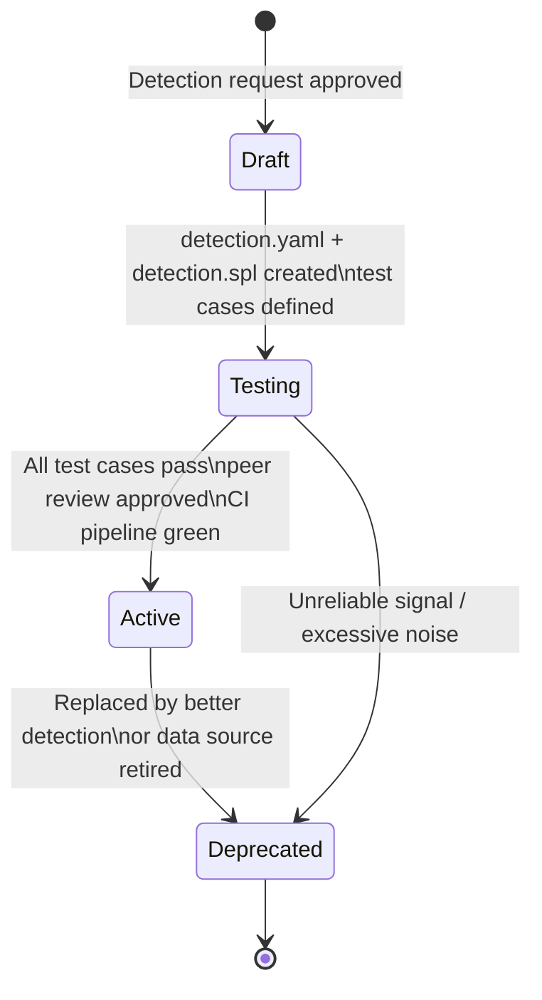

# Detection Engineering Standards

## Purpose

This document defines the standards, processes, and quality criteria governing detection development in this program. All detections entering the active state must conform to these standards. Engineers should treat this document as the authoritative reference for detection authorship decisions.

---

## Detection Lifecycle

Every detection moves through five lifecycle states. Promotion between states requires specific criteria to be met.



### Draft

- Detection request created via GitHub Issue template
- Initial hypothesis documented
- Data source requirements identified
- MITRE ATT&CK technique mapped
- No SPL or test cases required

### Testing

- `detection.yaml` complete with all required fields
- `detection.spl` written and syntactically valid
- At least one positive test case defined (expected_alert: true)
- At least one negative test case defined (expected_alert: false) where applicable
- Sample dataset exists in `data/samples/` for each test case
- Does not need to pass all test cases yet

### Active

- All test cases pass in the validation framework
- Peer review completed by a second engineer
- CI pipeline passes on the PR
- Playbook exists in `incident_response/playbooks/`
- MITRE ATT&CK mapping confirmed
- Tuning notes documented
- Deployed to Splunk and enabled as a scheduled search

### Deprecated

- Detection ID and directory retained (never deleted)
- `status: deprecated` in `detection.yaml`
- Deprecation reason documented in `detection.yaml`
- If replaced: replacement detection ID noted
- Disabled in Splunk

---

## Detection Naming Conventions

### Detection ID

Format: `CDET-{NNN}`

- Prefix `C` = Cloud (distinguishes from endpoint or network programs)
- `DET` = Detection
- Three-digit zero-padded sequence number
- IDs assigned sequentially; never reused

### Detection Directory

Format: `{detection_id}_{snake_case_descriptive_name}`

The name should describe the **behavior detected**, not the alert title or technique name.

**Correct:** `CDET-005_cloudtrail_logging_disabled`
**Incorrect:** `CDET-005_T1562_impair_defenses`

### Detection File Names

| File | Description |
|------|-------------|
| `detection.yaml` | Metadata, test cases, configuration |
| `detection.spl` | SPL correlation search logic |
| `README.md` | Human-readable summary (optional but recommended) |

### Alert Titles

Alert titles displayed in Splunk follow this format:

```
[CDET-{NNN}] {Action Verb} {Object} {Context}
```

Examples:
- `[CDET-001] IAM User Created Outside Approved Pipeline`
- `[CDET-005] CloudTrail Logging Disabled in Region`
- `[CDET-012] Cross-Account Role Assumption Chain Detected`

Titles should read as declarative statements of the detected behavior. Avoid vague titles like "Suspicious IAM Activity" or titles that just restate the technique name.

---

## SPL Standards

### Macro Usage

All detection searches must reference indexes via macros, never hardcoded strings.

```spl
`aws_cloudtrail_index`        ← correct
index=aws_cloudtrail          ← do not use in detection files
```

### Search Efficiency

1. Filter on indexed fields first (`index`, `sourcetype`, `eventName`)
2. Apply `where` clauses before `eval` and `stats`
3. Avoid `search` commands within detection logic
4. Use `lookup` for reference data (approved principals, known CIDRs)

### Field Reference Style

Use dot-notation for nested fields consistently:

```spl
userIdentity.type             ← correct
'userIdentity.type'           ← acceptable when field name contains special chars
```

### Time Handling

Use `_time` for all time-based calculations. Do not use `now()` in scheduled searches.

### Comment Style

Inline comments in SPL use the pipe comment pattern:

```spl
`aws_cloudtrail_index`
| where eventName="StopLogging"
`comment("Filter to the CloudTrail management API source")`
| where eventSource="cloudtrail.amazonaws.com"
```

### Required Output Fields

Every detection search must produce at minimum:

| Field | Description |
|-------|-------------|
| `_time` | Event timestamp |
| `eventName` | CloudTrail API call name |
| `principal_arn` | Full ARN of the acting principal |
| `sourceIPAddress` | Source IP of the request |
| `awsRegion` | AWS region where the event occurred |
| `severity` | Detection severity (critical/high/medium/low) |
| `tactic` | MITRE ATT&CK tactic name |
| `technique` | MITRE ATT&CK technique ID |

---

## Severity Framework

Detection severity is set at authorship time and reflects the inherent risk of the detected behavior when the alert is a true positive. Severity is documented in `docs/detection_engineering/severity_framework.md`.

Summary:

| Severity | When to Use |
|----------|-------------|
| Critical | Behavior that is almost exclusively malicious and indicates active compromise |
| High | Strong indicator of malicious intent; rare legitimate causes |
| Medium | Suspicious behavior with plausible legitimate explanations; context required |
| Low | Low-confidence indicator; useful for hunting and correlation |

---

## ATT&CK Mapping Methodology

Every detection must map to at least one MITRE ATT&CK technique. The process:

1. Identify the **adversary behavior** the detection observes (not the data source or API call)
2. Search the ATT&CK matrix for the technique that most precisely describes that behavior
3. Prefer sub-techniques over parent techniques when a sub-technique exists
4. Document the mapping rationale in `detection.yaml` under `technique_name`
5. If the behavior maps to multiple techniques, list the primary technique in `detection.yaml` and secondary techniques in a `secondary_techniques` field

**Common mapping errors to avoid:**

- Mapping to "Discovery" simply because the API call is a List or Describe operation — only map if the event pattern indicates adversarial enumeration
- Using the parent technique when a sub-technique exists (e.g., use T1562.008 not T1562)
- Mapping to "Impact" for any deletion — verify intent is destruction, not cleanup

---

## Tuning Process

### Initial Tuning (before Active state)

Before promoting a detection to Active:

1. Run the detection against 30 days of CloudTrail data from the target environment
2. Count false positive rate (FPs per day)
3. Target: fewer than 5 FPs per day for HIGH/CRITICAL; fewer than 20 for MEDIUM/LOW
4. For each FP category, evaluate:
   - Add suppression via lookup table (preferred)
   - Add filter condition to SPL
   - Adjust detection logic to require additional corroborating fields

### Ongoing Tuning

After a detection is Active:

- FP reports submitted via GitHub Issue (false_positive_report.md template)
- Each FP report is evaluated within 5 business days
- Suppression additions do not require full PR review; annotation-only changes require a brief review
- If FP rate exceeds threshold for 7 consecutive days, detection is moved back to Testing

### Suppression Architecture

Suppression is implemented via Splunk lookup tables, not hard-coded SPL filters.

```
splunk/lookups/
├── approved_iam_principals.csv     # IAM ARNs excluded from identity detections
├── approved_cidr_ranges.csv        # Trusted source CIDRs
├── approved_regions.csv            # Expected operational regions
└── automation_role_arns.csv        # Automation/pipeline roles
```

Using lookup tables means suppressions can be updated by security operations staff without modifying detection code or triggering a deployment.

---

## False Positive Handling

### Triage Criteria

When an analyst determines an alert is a false positive:

1. Document the specific event that triggered the alert
2. Identify which attribute(s) caused the FP (wrong principal, expected behavior, automation)
3. Submit a false positive report via GitHub Issue
4. Determine suppression approach (lookup addition vs. logic change)
5. Add test case to `detection.yaml` with `expected_alert: false` for the FP scenario

### Categories

| Category | Suppression Method |
|----------|--------------------|
| Known automation | Add role ARN to `automation_role_arns.csv` lookup |
| Break-glass access | Add ARN to `approved_iam_principals.csv` |
| Expected regional activity | Add region to `approved_regions.csv` |
| Legitimate business process | Add `where` clause with documented business justification |

### Escalation

If an analyst is unsure whether an alert is a false positive, it should be treated as a true positive and investigated until definitively ruled out. Never dismiss an alert solely because it looks like automation.
