# Detection Engineering Workflow

This flowchart describes the full detection engineering lifecycle — from identifying a new threat hypothesis through sample data creation, validation, peer review, promotion to Active status, and ongoing health monitoring. Every detection rule (CDET) follows this process before it is permitted to fire in production.

```mermaid
flowchart TD
    A([Threat Identification]) --> A1[Threat Intel Report\nor Red Team Finding\nor MITRE ATT&CK Coverage Gap]
    A1 --> B

    B([Detection Design]) --> B1[Write hypothesis statement]
    B1 --> B2[Identify data source and required fields]
    B2 --> B3[Draft SPL logic and thresholds]
    B3 --> B4[Design lookup suppression CSV\ne.g. approved_iam_principals.csv]
    B4 --> C

    C([Sample Data Creation]) --> C1[Write malicious_case NDJSON\nsample_logs/cloudtrail/CDET-XXX/positive/]
    C1 --> C2[Write benign_case NDJSON\nsample_logs/cloudtrail/CDET-XXX/negative/]
    C2 --> C3[Write edge_case NDJSON\nsample_logs/cloudtrail/CDET-XXX/edge/]
    C3 --> D

    D([Python Heuristic Validation]) --> D1[Run detection_validator.py\nagainst NDJSON test cases]
    D1 --> DQ1{Positive test PASS?}
    DQ1 -->|No| B
    DQ1 -->|Yes| DQ2{Negative test PASS?}
    DQ2 -->|No| LU[Update lookup suppression CSV\nand re-run]
    LU --> DQ2
    DQ2 -->|Yes| DQ3{Edge test PASS?}
    DQ3 -->|No| EDGE_DOC[Document expected behaviour\nin edge_case.md]
    EDGE_DOC --> DQ3
    DQ3 -->|Yes| E

    E([Splunk SPL Validation]) --> E1[Load NDJSON into Splunk\nvia Splunk HEC or UF monitor]
    E1 --> E2[Run saved search from\ndetection_validation.conf]
    E2 --> E3[Verify alert writes to cdet_alerts index]
    E3 --> E4[Verify expected_alert.json fields match\nactual alert output]
    E4 --> F

    F([Peer Review Gate]) --> F1[Complete checklist.md:\n- All 3 test types PASS\n- expected_alert.json matches\n- SPL logic reviewed\n- Lookup tables verified\n- ATT&CK mapping documented]
    F1 --> FQ1{Peer review PASS?}
    FQ1 -->|No| B
    FQ1 -->|Yes| G

    G([Promotion]) --> G1[Update status: Testing → Active\nin detections/splunk/CDET-XXX/metadata.json]
    G1 --> G2[Enable scheduled search\nin savedsearches.conf]
    G2 --> H

    H([Monitoring]) --> H1[Schedule health check\nvia detection_health.conf]
    H1 --> H2[Track false positive rate]
    H2 --> H3{FP rate acceptable?}
    H3 -->|No — tune needed| B
    H3 -->|Yes| H4[Detection Active and Healthy]

    classDef stage fill:#3776AB,stroke:#2B5F8A,color:#fff
    classDef action fill:#ECF0F1,stroke:#BDC3C7,color:#000
    classDef decision fill:#FF9900,stroke:#CC7700,color:#000
    classDef artifact fill:#8E44AD,stroke:#6C3483,color:#fff
    classDef healthy fill:#2ECC71,stroke:#229954,color:#000

    class A,B,C,D,E,F,G,H stage
    class DQ1,DQ2,DQ3,FQ1,H3 decision
    class H4 healthy
```

## Validation Artifact Reference

Each CDET directory must contain these five files before peer review:

| Artifact | Path | Purpose |
|----------|------|---------|
| `expected_alert.json` | `detections/splunk/CDET-XXX/tests/expected_alert.json` | Defines the exact fields and values expected in the cdet_alerts index when the detection fires |
| `positive_case.md` | `detections/splunk/CDET-XXX/tests/positive_case.md` | Documents the malicious scenario that must trigger the alert |
| `negative_case.md` | `detections/splunk/CDET-XXX/tests/negative_case.md` | Documents the benign scenario that must NOT trigger the alert |
| `edge_case.md` | `detections/splunk/CDET-XXX/tests/edge_case.md` | Documents boundary conditions and expected behaviour |
| `checklist.md` | `detections/splunk/CDET-XXX/tests/checklist.md` | Peer review gate — all items must be checked before promotion |

Sample NDJSON test data lives in `sample_logs/cloudtrail/CDET-XXX/` with subdirectories `positive/`, `negative/`, and `edge/`.
