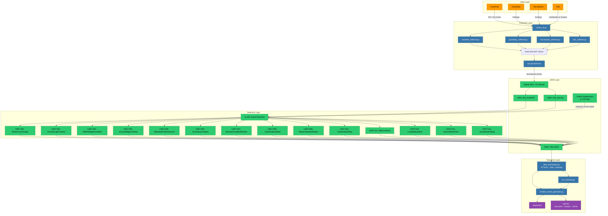

# End-to-End Architecture

This diagram shows the complete data flow and component relationships across all layers of the Cloud Threat Detection Lab — from raw AWS telemetry through collection, normalization, SIEM ingestion, detection, and incident response.

## Component File Path Reference

| Node | File Path in Repository |
|------|------------------------|
| CloudTrail | AWS managed service |
| GuardDuty | AWS managed service |
| SecurityHub | AWS managed service |
| IAM | AWS managed service |
| collect_cli.py | `scripts/aws_collectors/collect_cli.py` |
| cloudtrail_collector.py | `scripts/aws_collectors/cloudtrail_collector.py` |
| guardduty_collector.py | `scripts/aws_collectors/guardduty_collector.py` |
| securityhub_collector.py | `scripts/aws_collectors/securityhub_collector.py` |
| iam_collector.py | `scripts/aws_collectors/iam_collector.py` |
| data/collected/*.ndjson | `data/collected/` |
| CloudTrailParser | `scripts/aws_collectors/cloudtrail_parser.py` |
| Splunk HEC / UF Monitor | `ingestion/` |
| Index: aws_cloudtrail | Splunk index (configured in `splunk/indexes.conf`) |
| Index: aws_security | Splunk index (configured in `splunk/indexes.conf`) |
| Index: cdet_alerts | Splunk index (configured in `splunk/indexes.conf`) |
| Lookup Suppression (11 CSVs) | `splunk/lookups/*.csv` |
| 14 SPL Saved Searches | `detections/splunk/` |
| CDET-001 through CDET-014 | `detections/splunk/CDET-00X/` |
| alert_enrichment.py | `enrichment/alert_enrichment.py` |
| ioc_extractor.py | `enrichment/ioc_extractor.py` |
| incident_report_generator.py | `incident_response/incident_report_generator.py` |
| playbooks/ | `playbooks/` |
| reports/ | `reports/` |
