# Incident Response Workflow

This flowchart covers the full incident response lifecycle — from the moment an alert fires in the `cdet_alerts` Splunk index through triage, investigation, severity-based escalation, containment (with approval gates), recovery, and post-incident activities. Parallel tracks are shown where evidence collection and containment preparation can proceed simultaneously.

```mermaid
flowchart TD
    START([Alert fires in cdet_alerts index]) --> NOTIFY

    NOTIFY[On-call analyst receives\nPagerDuty / Slack notification] --> TRIAGE

    subgraph TRIAGE_PHASE["Triage — target: 10 minutes"]
        TRIAGE([Open playbooks/CDET-XXX/triage.md]) --> TQ1{Is actor ARN in\napproved_iam_principals.csv?}
        TQ1 -->|Yes| FP_PATH
        TQ1 -->|No| TQ2{Was MFA used\nduring the action?}
        TQ2 -->|No — escalation factor| SEV_UP1[Flag: elevated severity]
        TQ2 -->|Yes| TQ3
        SEV_UP1 --> TQ3{Is source region\nin expected_regions.csv?}
        TQ3 -->|No — escalation factor| SEV_UP2[Flag: elevated severity]
        TQ3 -->|Yes| VERDICT
        SEV_UP2 --> VERDICT
    end

    FP_PATH[Document FP reason\nupdate lookup CSV\nclose ticket] --> DONE_FP([Ticket closed — FP])

    VERDICT{True Positive or\nFalse Positive?} -->|False Positive| FP_PATH
    VERDICT -->|True Positive| INVEST_START

    subgraph INVESTIGATE["Investigation — target: 30-60 minutes"]
        INVEST_START([Open playbooks/CDET-XXX/investigation.md]) --> PIV[Run recommended pivot queries\nfrom alert_enrichment.py output]
        PIV --> EVID[Collect evidence:\nevent IDs, actor ARN,\nsource IPs, full timeline]
        EVID --> REPORT_GEN[Run incident_report_generator.py\nGenerate analyst report + JSON bundle]
    end

    REPORT_GEN --> SEV_ASSESS

    subgraph SEV_PHASE["Severity Assessment — from alert_enrichment.py enriched_severity"]
        SEV_ASSESS([Evaluate enriched_severity field]) --> SEV_Q{Severity level?}
        SEV_Q -->|Critical| CRIT[Immediate escalation\nDeclare war room\nNotify CISO]
        SEV_Q -->|High| HIGH[Notify senior analyst\nand team lead]
        SEV_Q -->|Medium or Low| STD[Standard analyst workflow]
    end

    CRIT --> APPROVAL
    HIGH --> APPROVAL
    STD --> CONTAIN_PREP

    APPROVAL{Approval gate:\nDestructive action approved?} -->|Approved| CONTAIN_PREP
    APPROVAL -->|Denied — escalate| CRIT

    subgraph PARALLEL["Parallel Tracks"]
        direction LR
        CONTAIN_PREP([Open playbooks/CDET-XXX/containment.md]) --> CONT_CMDS[Execute AWS CLI\ncontainment commands\ne.g. deny policy, disable key]
        EVID_PRESERVE([Preserve evidence artifacts]) --> CHAIN[Maintain chain of custody\nfor forensics]
    end

    CONTAIN_PREP -.->|parallel| EVID_PRESERVE
    CONT_CMDS --> RECOVERY
    CHAIN --> RECOVERY

    subgraph RECOVERY_PHASE["Recovery"]
        RECOVERY([Open playbooks/CDET-XXX/recovery.md]) --> RESTORE[Restore normal operations\nvalidate service health]
        RESTORE --> HARDEN[Apply hardening steps\ne.g. enforce MFA, rotate keys,\nreview SCPs]
    end

    HARDEN --> POST

    subgraph POST_INCIDENT["Post-Incident"]
        POST([Post-incident review]) --> EXEC_RPT[Generate executive report\nincident_report_generator.py --format executive]
        EXEC_RPT --> LESSONS[Document lessons learned]
        LESSONS --> DET_UPDATE{Detection update\nneeded?}
        DET_UPDATE -->|Yes| TUNE[Return to Detection\nEngineering Workflow\nrevise SPL or lookup]
        DET_UPDATE -->|No| CLOSE
    end

    CLOSE([Ticket closed — TP resolved]) --> METRICS[Update mean-time-to-detect\nand mean-time-to-respond metrics]

    classDef phase fill:#3776AB,stroke:#2B5F8A,color:#fff
    classDef action fill:#ECF0F1,stroke:#BDC3C7,color:#000
    classDef decision fill:#FF9900,stroke:#CC7700,color:#000
    classDef fp fill:#E74C3C,stroke:#C0392B,color:#fff
    classDef done fill:#2ECC71,stroke:#229954,color:#000
    classDef response fill:#8E44AD,stroke:#6C3483,color:#fff
    classDef gate fill:#E67E22,stroke:#CA6F1E,color:#fff

    class START,TRIAGE_PHASE,INVESTIGATE,SEV_PHASE,RECOVERY_PHASE,POST_INCIDENT phase
    class VERDICT,TQ1,TQ2,TQ3,SEV_Q,DET_UPDATE decision
    class APPROVAL gate
    class FP_PATH fp
    class DONE_FP,CLOSE,METRICS done
    class CRIT,HIGH,STD,APPROVAL response
```

## Playbook File Reference

| Playbook Document | Path | Purpose |
|-------------------|------|---------|
| Triage guide | `playbooks/CDET-XXX/triage.md` | Step-by-step triage instructions, lookup checks, escalation criteria |
| Investigation guide | `playbooks/CDET-XXX/investigation.md` | Pivot query templates, evidence collection checklist |
| Containment guide | `playbooks/CDET-XXX/containment.md` | Approved AWS CLI commands, approval requirements |
| Recovery guide | `playbooks/CDET-XXX/recovery.md` | Restoration steps, hardening checklist |
| Alert enrichment output | `enrichment/alert_enrichment.py` | Provides `enriched_severity`, ATT&CK mappings, IAM context, pivot queries |
| Incident report generator | `incident_response/incident_report_generator.py` | Produces executive, analyst, and JSON reports |
| Reports output | `reports/` | Final report artifacts for audit and leadership |
| Approved principals lookup | `splunk/lookups/approved_iam_principals.csv` | Known-good actors used in triage FP check |
| Expected regions lookup | `splunk/lookups/expected_regions.csv` | Known-good regions used in triage escalation check |

## Timing Targets

| Phase | Target Duration |
|-------|----------------|
| Notification to triage start | < 5 minutes |
| Triage (TP/FP determination) | < 10 minutes |
| Investigation and evidence collection | 30-60 minutes |
| Containment execution (post approval) | < 30 minutes |
| Executive report delivery | < 4 hours from alert |
