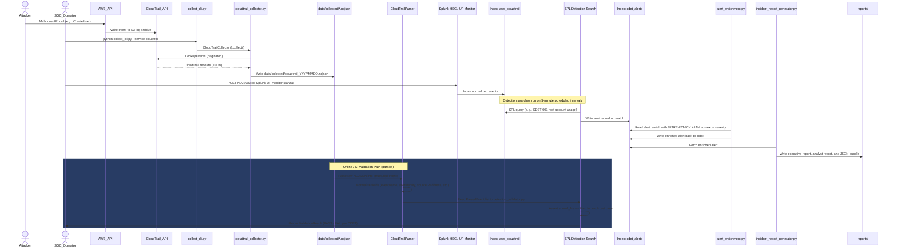

# Telemetry Pipeline

This sequence diagram traces the exact data flow from an adversary's malicious AWS API call all the way through collection, normalization, SIEM ingestion, detection, enrichment, and report generation. A parallel offline validation path is also shown for detection engineering work done outside of Splunk.

## Pipeline Stage Reference

| Stage | Key File(s) |
|-------|------------|
| AWS API event generation | AWS managed (CloudTrail S3 bucket) |
| Collection CLI entrypoint | `scripts/aws_collectors/collect_cli.py` |
| CloudTrail collector | `scripts/aws_collectors/cloudtrail_collector.py` |
| NDJSON output directory | `data/collected/` |
| Normalization / parsing | `scripts/aws_collectors/cloudtrail_parser.py` |
| Splunk ingestion config | `ingestion/` |
| Detection SPL searches | `detections/splunk/CDET-00X/` |
| Alert enrichment | `enrichment/alert_enrichment.py` |
| Incident report generator | `incident_response/incident_report_generator.py` |
| Report output | `reports/` |
| Offline validation | `validation/detection_validator.py` |
