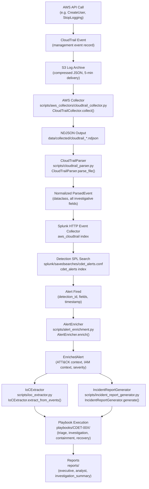
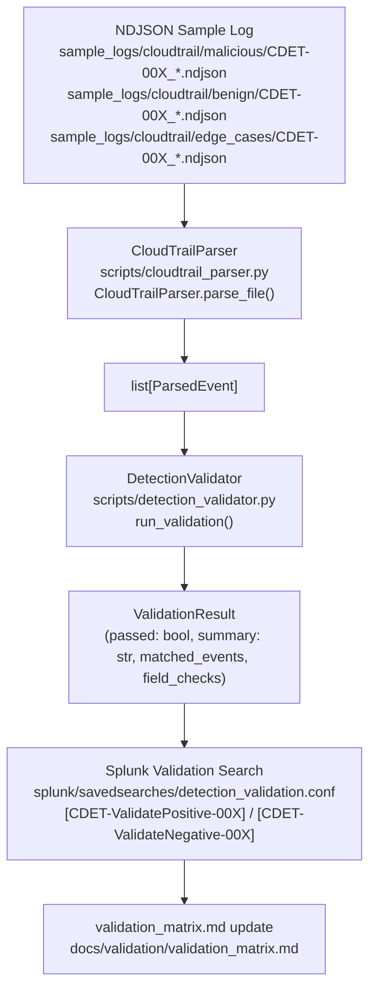

# End-to-End Workflow: AWS Event to Closed Incident

This document traces every stage of the Cloud Threat Detection Lab pipeline from the moment an AWS API call is made to the point where an incident is closed and a report is filed.

---

## 1. Production Detection Pipeline



---

## 2. Stage-by-Stage Breakdown

### Stage 1 — AWS API Call → CloudTrail Event
- **What happens:** Any AWS API call (management event) is recorded by CloudTrail automatically.
- **Component:** AWS CloudTrail service (no lab code involved).
- **Output:** A structured JSON event record containing `eventName`, `eventSource`, `userIdentity`, `requestParameters`, `responseElements`, `sourceIPAddress`, and `eventTime`.

### Stage 2 — CloudTrail Event → S3 Log Archive
- **What happens:** CloudTrail aggregates events and delivers compressed log files to an S3 bucket approximately every 5 minutes.
- **Component:** AWS CloudTrail → S3 (no lab code involved).
- **Output:** `s3://your-bucket/AWSLogs/<account-id>/CloudTrail/<region>/<date>/<file>.json.gz`

### Stage 3 — S3 Log Archive → AWS Collector
- **Module:** `scripts/aws_collectors/cloudtrail_collector.py` — `CloudTrailCollector`
- **Entry point:** `scripts/aws_collectors/collect_cli.py` — invoked as `python scripts/aws_collectors/collect_cli.py --service cloudtrail`
- **Credentials:** `boto3.Session()` default chain via `aws configure`. No hardcoded credentials.
- **What it does:** Calls the CloudTrail `LookupEvents` API with pagination, pulling recent management events. Writes one JSON record per line.
- **Output:** `data/collected/cloudtrail_<timestamp>.ndjson` — one raw CloudTrail JSON record per line.

### Stage 4 — NDJSON Output → CloudTrailParser
- **Module:** `scripts/cloudtrail_parser.py` — `CloudTrailParser`
- **Method:** `CloudTrailParser().parse_file(path)` returns an `Iterator[ParsedEvent]`
- **What it does:** Reads raw CloudTrail JSON (single-record, NDJSON, or S3 gzip format) and maps fields to the `ParsedEvent` dataclass. Handles missing or null fields defensively.
- **Output:** `ParsedEvent` dataclass instances — see the data format section below.

### Stage 5 — ParsedEvent → Splunk HTTP Event Collector
- **How:** NDJSON files are forwarded to Splunk via the HTTP Event Collector (HEC) endpoint or a Splunk Universal Forwarder pointed at `data/collected/`.
- **Target index:** `aws_cloudtrail`
- **Field extraction:** Splunk extracts CloudTrail fields at index time using the props/transforms configured for the `aws_cloudtrail` sourcetype.

### Stage 6 — Detection SPL Search → Alert
- **Config:** `splunk/savedsearches/cdet_alerts.conf` — 14 saved search stanzas, one per CDET.
- **Schedule:** Searches run on cron schedules (typically every 5 minutes for high-severity detections).
- **Lookup suppression:** Each SPL search joins against `splunk/lookups/` CSVs to suppress known-benign activity before firing. See Section 4.
- **Output:** An alert event written to the `cdet_alerts` index containing `detection_id`, `event_fields`, `timestamp`, and `alert_severity`.

### Stage 7 — Alert → AlertEnricher
- **Module:** `scripts/alert_enrichment.py` — `AlertEnricher`
- **Method:** `AlertEnricher(session).enrich(alert_dict)` returns `EnrichedAlert`
- **Invocation:** Called as a Splunk Adaptive Response action or standalone from `scripts/`.
- **What it adds:**
  - ATT&CK tactic, technique ID, technique name, and Navigator URL
  - IAM principal context (existence, MFA status, attached policies, key count) via live AWS API call
  - Severity escalation check against predefined escalation rules
  - Lookup cross-reference (approved principals, automation roles, admin policies)
  - Recommended pivot SPL queries for the investigation
- **Output:** `EnrichedAlert` dataclass — see data format section below.

### Stage 8 — EnrichedAlert → IoCExtractor + IncidentReportGenerator
- **IoCExtractor** (`scripts/ioc_extractor.py`): Scans `ParsedEvent` objects and the enriched alert for structured IOCs — IP addresses, IAM ARNs, access key IDs, S3 paths, EC2 instance IDs. Returns an `IoCReport`.
- **IncidentReportGenerator** (`scripts/incident_report_generator.py`): Consumes the `EnrichedAlert` and `ParsedEvent` list. Produces three output formats: executive summary (Markdown), analyst report (Markdown), and investigation summary (JSON).

### Stage 9 — Playbook Execution
- **Location:** `playbooks/CDET-00X/<phase>.md`
- **Four phases per CDET:** triage, investigation, containment, recovery (56 files total).
- **How reached:** The `IncidentReportGenerator` embeds the relevant playbook path in the analyst report. The on-call analyst follows the playbook steps.

### Stage 10 — Reports
- **Location:** `reports/` — templates and generated output.
- **Three formats:** executive summary (business-facing), analyst report (technical timeline + IOCs), investigation summary (machine-readable JSON for SIEM re-ingestion).

---

## 3. Validation Pipeline



The validation pipeline operates independently of the production pipeline. It is the quality gate that must pass before a detection is promoted to Active status. See `docs/integration/validation_results.md` for the current status of all 14 CDETs.

---

## 4. Lookup-Mediated Suppression

The `splunk/lookups/` directory contains 11 CSV files that act as allowlists at detection time. Every production SPL detection search performs one or more `lookup` commands before firing an alert. The suppression logic works as follows:

| Lookup CSV | Purpose | Used by |
|---|---|---|
| `approved_iam_principals.csv` | Known-good IAM users/roles that legitimately create accounts | CDET-001, CDET-002, CDET-004 |
| `automation_role_arns.csv` | CI/CD and automation roles exempt from lateral movement checks | CDET-001, CDET-012 |
| `admin_policy_arns.csv` | List of admin-equivalent policy ARNs for privilege escalation scope | CDET-004 |
| `approved_aws_accounts.csv` | Trusted external account IDs for cross-account role trust checks | CDET-005, CDET-009, CDET-012 |
| `approved_cidr_ranges.csv` | Internal CIDR blocks; external IP hits escalate severity | CDET-007, CDET-013 |
| `approved_regions.csv` | Regions where compute launch is authorized | CDET-011 |
| `cloudtrail_log_buckets.csv` | Authoritative list of CloudTrail log buckets for deletion checks | CDET-014 |
| `ec2_private_cidr_ranges.csv` | Private address space for IMDS abuse filtering | CDET-007 |
| `privileged_iam_users.csv` | Accounts subject to heightened monitoring | CDET-006 |
| `suspicious_instance_types.csv` | GPU/high-cost instance types that trigger resource hijacking alerts | CDET-011 |

The SPL pattern used in every detection is:

```spl
| lookup <table>.csv <key_field> OUTPUT approved
| where isnull(approved)
```

An event only proceeds to the alert stage if the lookup returns `NULL` (i.e., the actor is not on any allowlist). This eliminates the most common false-positive source — authorized automation — before an alert is ever written.

---

## 5. Data Formats at Each Stage

### Raw CloudTrail JSON (Stage 2 output)
```json
{
  "eventVersion": "1.08",
  "userIdentity": {
    "type": "IAMUser",
    "principalId": "AIDAEXAMPLEID",
    "arn": "arn:aws:iam::123456789012:user/attacker",
    "accountId": "123456789012",
    "userName": "attacker"
  },
  "eventTime": "2026-06-18T03:14:15Z",
  "eventSource": "iam.amazonaws.com",
  "eventName": "CreateUser",
  "awsRegion": "us-east-1",
  "sourceIPAddress": "203.0.113.45",
  "userAgent": "aws-cli/2.x",
  "requestParameters": {"userName": "backdoor-user"},
  "responseElements": {"user": {"userId": "AIDANEWUSER", "arn": "..."}}
}
```

### ParsedEvent dataclass (Stage 4 output)
```
ParsedEvent(
    event_id         = "abc-123-...",
    event_time       = datetime(2026, 6, 18, 3, 14, 15, tzinfo=UTC),
    event_name       = "CreateUser",
    event_source     = "iam.amazonaws.com",
    aws_region       = "us-east-1",
    source_ip_address= "203.0.113.45",
    user_agent       = "aws-cli/2.x",
    identity_type    = "IAMUser",
    identity_arn     = "arn:aws:iam::123456789012:user/attacker",
    identity_account_id = "123456789012",
    identity_username   = "attacker",
    session_issuer_arn  = None,
    session_issuer_type = None,
    mfa_authenticated   = False,
    error_code       = None,
    error_message    = None,
    request_parameters  = {"userName": "backdoor-user"},
    response_elements   = {"user": {...}},
    is_read_only        = False,
    is_management_event = True,
    raw              = {<original dict>}
)
```

### Splunk fields (Stage 5 — post-index extraction)
| Splunk Field | Source CloudTrail Field |
|---|---|
| `eventName` | `eventName` |
| `eventSource` | `eventSource` |
| `userIdentity_type` | `userIdentity.type` |
| `userIdentity_arn` | `userIdentity.arn` |
| `userIdentity_accountId` | `userIdentity.accountId` |
| `userIdentity_userName` | `userIdentity.userName` |
| `sourceIPAddress` | `sourceIPAddress` |
| `awsRegion` | `awsRegion` |
| `errorCode` | `errorCode` |
| `requestParameters` | `requestParameters` (JSON string) |
| `responseElements` | `responseElements` (JSON string) |

### EnrichedAlert fields (Stage 7 output)
```
EnrichedAlert(
    original                  = {<original alert dict>},
    attack_tactic             = "Persistence",
    attack_technique          = "T1136.003",
    attack_technique_name     = "Create Account: Cloud Account",
    attack_url                = "https://attack.mitre.org/techniques/T1136/003/",
    principal_exists          = True,
    principal_mfa_active      = False,
    principal_attached_policies = ["arn:aws:iam::aws:policy/AdministratorAccess"],
    principal_access_key_count  = 1,
    base_severity             = "high",
    enriched_severity         = "critical",
    severity_escalation_reason= "no_mfa + admin_policy_attached",
    principal_in_approved_list= False,
    recommended_queries       = ["index=aws_cloudtrail userIdentity_arn=..."],
    enrichment_errors         = []
)
```

### IncidentReport (Stage 8 output)
The generator produces:
- `reports/generated/<incident_id>_executive.md` — one-page business impact summary
- `reports/generated/<incident_id>_analyst.md` — full technical timeline, IOC table, evidence chain, recommended SPL
- `reports/generated/<incident_id>_summary.json` — machine-readable record suitable for SIEM re-ingestion, containing all `EnrichedAlert` fields plus `IoCReport` data and playbook reference paths
