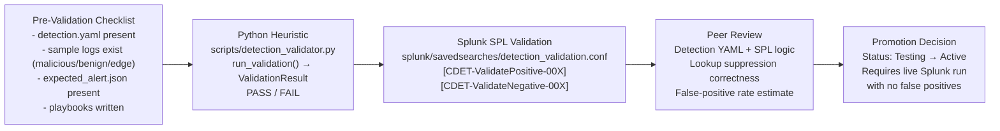

# Validation Results: CDET-001 through CDET-014

This document records the current validation state of all 14 detection rules in the Cloud Threat Detection Lab. All detections are in **Testing** status pending live Splunk deployment.

---

## 1. Validation Workflow

Each detection must pass five sequential stages before it is promoted to Active status.



---

## 2. Detection Validation Summary Table

All 14 CDETs have complete test data, heuristic validators, and Splunk validation searches. Status is **Testing** for all until a live Splunk environment confirms zero false positives on negative and edge-case data.

| ID | Detection Name | Tactic | Positive Test File | Negative Test File | Edge Case File | Python Validator | Splunk Search | Status |
|---|---|---|---|---|---|---|---|---|
| CDET-001 | IAM User Created Outside Pipeline | Persistence | `sample_logs/cloudtrail/malicious/CDET-001_iam_user_created_outside_pipeline.ndjson` | `sample_logs/cloudtrail/benign/CDET-001_pipeline_createuser.ndjson` | `sample_logs/cloudtrail/edge_cases/CDET-001_edge_approved_role_unusual_region.ndjson` | `_detect_001` in `detection_validator.py` | `[CDET-ValidatePositive-001]` in `detection_validation.conf` | Testing |
| CDET-002 | IAM Access Key Created for Existing User | Persistence | `sample_logs/cloudtrail/malicious/CDET-002_iam_access_key_created_for_existing_user.ndjson` | `sample_logs/cloudtrail/benign/CDET-002_self_key_creation.ndjson` | `sample_logs/cloudtrail/edge_cases/CDET-002_edge_key_rotation_same_day.ndjson` | `_detect_002` in `detection_validator.py` | `[CDET-ValidatePositive-002]` in `detection_validation.conf` | Testing |
| CDET-003 | CloudTrail Logging Disabled | Defense Evasion | `sample_logs/cloudtrail/malicious/CDET-003_cloudtrail_logging_disabled.ndjson` | `sample_logs/cloudtrail/benign/CDET-003_benign_updatetrail.ndjson` | `sample_logs/cloudtrail/edge_cases/CDET-003_edge_cloudtrail_update_not_disable.ndjson` | `_detect_003` in `detection_validator.py` | `[CDET-ValidatePositive-003]` in `detection_validation.conf` | Testing |
| CDET-004 | Admin Policy Attached to Principal | Privilege Escalation | `sample_logs/cloudtrail/malicious/CDET-004_admin_policy_attached.ndjson` | `sample_logs/cloudtrail/benign/CDET-004_benign_policy_attach.ndjson` | `sample_logs/cloudtrail/edge_cases/CDET-004_edge_readonly_policy_attached.ndjson` | `_detect_004` in `detection_validator.py` | `[CDET-ValidatePositive-004]` in `detection_validation.conf` | Testing |
| CDET-005 | Cross-Account Role Trust Modified | Privilege Escalation | `sample_logs/cloudtrail/malicious/CDET-005_cross_account_role_trust_modified.ndjson` | `sample_logs/cloudtrail/benign/CDET-005_same_account_trust.ndjson` | `sample_logs/cloudtrail/edge_cases/CDET-005_edge_same_account_trust_update.ndjson` | `_detect_005` in `detection_validator.py` | `[CDET-ValidatePositive-005]` in `detection_validation.conf` | Testing |
| CDET-006 | Root Account Activity | Initial Access | `sample_logs/cloudtrail/malicious/CDET-006_root_account_activity.ndjson` | `sample_logs/cloudtrail/benign/CDET-006_non_root_activity.ndjson` | `sample_logs/cloudtrail/edge_cases/CDET-006_edge_root_account_read_only.ndjson` | `_detect_006` in `detection_validator.py` | `[CDET-ValidatePositive-006]` in `detection_validation.conf` | Testing |
| CDET-007 | EC2 Metadata Credential Abuse | Credential Access | `sample_logs/cloudtrail/malicious/CDET-007_ec2_metadata_credential_abuse.ndjson` | `sample_logs/cloudtrail/benign/CDET-007_ec2_internal_api_call.ndjson` | `sample_logs/cloudtrail/edge_cases/CDET-007_edge_imds_v2_token_request.ndjson` | `_detect_007` in `detection_validator.py` | `[CDET-ValidatePositive-007]` in `detection_validation.conf` | Testing |
| CDET-008 | Excessive API Enumeration | Discovery | `sample_logs/cloudtrail/malicious/CDET-008_excessive_api_enumeration.ndjson` | `sample_logs/cloudtrail/benign/CDET-008_below_threshold.ndjson` | `sample_logs/cloudtrail/edge_cases/CDET-008_edge_lambda_api_burst.ndjson` | `_detect_008` in `detection_validator.py` | `[CDET-ValidatePositive-008]` in `detection_validation.conf` | Testing |
| CDET-009 | S3 Replication to External Account | Exfiltration | `sample_logs/cloudtrail/malicious/CDET-009_s3_replication_external_account.ndjson` | `sample_logs/cloudtrail/benign/CDET-009_same_account_replication.ndjson` | `sample_logs/cloudtrail/edge_cases/CDET-009_edge_replication_same_org.ndjson` | `_detect_009` in `detection_validator.py` | `[CDET-ValidatePositive-009]` in `detection_validation.conf` | Testing |
| CDET-010 | Mass S3 Object Deletion | Impact | `sample_logs/cloudtrail/malicious/CDET-010_mass_s3_object_deletion.ndjson` | `sample_logs/cloudtrail/benign/CDET-010_routine_deletion.ndjson` | `sample_logs/cloudtrail/edge_cases/CDET-010_edge_partial_prefix_deletion.ndjson` | `_detect_010` in `detection_validator.py` | `[CDET-ValidatePositive-010]` in `detection_validation.conf` | Testing |
| CDET-011 | Unauthorized Compute Resource Launch | Impact | `sample_logs/cloudtrail/malicious/CDET-011_unauthorized_compute_launch.ndjson` | `sample_logs/cloudtrail/benign/CDET-011_approved_launch.ndjson` | `sample_logs/cloudtrail/edge_cases/CDET-011_edge_approved_instance_type_approved_region.ndjson` | `_detect_011` in `detection_validator.py` | `[CDET-ValidatePositive-011]` in `detection_validation.conf` | Testing |
| CDET-012 | Cross-Account AssumeRole Chain | Lateral Movement | `sample_logs/cloudtrail/malicious/CDET-012_cross_account_assumerole_chain.ndjson` | `sample_logs/cloudtrail/benign/CDET-012_approved_assumerole.ndjson` | `sample_logs/cloudtrail/edge_cases/CDET-012_edge_single_hop_assumerole.ndjson` | `_detect_012` in `detection_validator.py` | `[CDET-ValidatePositive-012]` in `detection_validation.conf` | Testing |
| CDET-013 | Security Group Opened to Internet | Defense Evasion | `sample_logs/cloudtrail/malicious/CDET-013_security_group_public_internet.ndjson` | `sample_logs/cloudtrail/benign/CDET-013_scoped_sg_rule.ndjson` | `sample_logs/cloudtrail/edge_cases/CDET-013_edge_security_group_internal_only.ndjson` | `_detect_013` in `detection_validator.py` | `[CDET-ValidatePositive-013]` in `detection_validation.conf` | Testing |
| CDET-014 | CloudTrail Log Deleted from S3 | Defense Evasion | `sample_logs/cloudtrail/malicious/CDET-014_cloudtrail_log_deleted.ndjson` | `sample_logs/cloudtrail/benign/CDET-014_non_cloudtrail_deletion.ndjson` | `sample_logs/cloudtrail/edge_cases/CDET-014_edge_s3_object_version_delete.ndjson` | `_detect_014` in `detection_validator.py` | `[CDET-ValidatePositive-014]` in `detection_validation.conf` | Testing |

---

## 3. What "Testing" Status Means

A detection in **Testing** status has the following guarantees:

- **detection.yaml exists** — the rule definition, MITRE ATT&CK mapping, severity, and lookup references are fully authored.
- **Sample data exists** — three test log files per CDET: a malicious positive case, a benign negative case, and at least one edge case that probes a boundary condition.
- **Expected alert exists** — `validation/<CDET-ID>/expected_alert.json` defines the exact fields and values the alert must contain when the detection fires.
- **Python heuristic validator exists** — `_detect_001` through `_detect_014` in `scripts/detection_validator.py` mirror the SPL detection logic in Python. These can be run offline against NDJSON files with no Splunk dependency.
- **Splunk validation searches exist** — `[CDET-ValidatePositive-00X]` and `[CDET-ValidateNegative-00X]` stanzas are present in `splunk/savedsearches/detection_validation.conf`, targeting the `aws_cloudtrail_test` index.
- **Playbooks exist** — all four playbook phases (triage, investigation, containment, recovery) are written.

**What is not yet confirmed** is that the SPL searches run correctly inside an actual Splunk environment. The **Testing → Active** promotion requires:

1. A running Splunk instance with the `aws_cloudtrail_test` index populated.
2. The positive test NDJSON ingested as `source=validation_positive` — the `[CDET-ValidatePositive-00X]` search must return at least 1 event.
3. The negative test NDJSON ingested as `source=validation_negative` — the `[CDET-ValidateNegative-00X]` search must return 0 events.
4. The edge case NDJSON ingested — the detection must produce the correct outcome (fire or suppress) for the documented edge condition.
5. Zero false positives observed on the negative and edge-case data sets.

Until steps 1–5 are confirmed against a live Splunk instance, status remains **Testing**.

---

## 4. Running the Full Validation Suite

### Offline Python validation (no Splunk required)

Run the Python heuristic validators against all 14 CDETs and all three log categories:

```bash
python scripts/detection_validator.py \
    --all \
    --log-dir sample_logs/cloudtrail \
    --output validation/validation_matrix.md
```

Or validate a single detection:

```bash
python scripts/detection_validator.py \
    --detection CDET-001 \
    --positive  sample_logs/cloudtrail/malicious/CDET-001_iam_user_created_outside_pipeline.ndjson \
    --negative  sample_logs/cloudtrail/benign/CDET-001_pipeline_createuser.ndjson \
    --edge      sample_logs/cloudtrail/edge_cases/CDET-001_edge_approved_role_unusual_region.ndjson
```

A `ValidationResult` is printed per test case:
```
[PASS] CDET-001/positive: fired (expected to fire)
[PASS] CDET-001/negative: did not fire (expected to NOT fire)
[PASS] CDET-001/edge: did not fire (expected to NOT fire)
```

### Splunk validation (requires live Splunk)

Once a Splunk instance is available:

1. Create the `aws_cloudtrail_test` index in Splunk.
2. Ingest positive test data: `source=validation_positive`, `sourcetype=aws:cloudtrail`, `index=aws_cloudtrail_test`.
3. Ingest negative test data: `source=validation_negative`.
4. Ingest edge case data: `source=validation_edge`.
5. Deploy `splunk/savedsearches/detection_validation.conf` to `$SPLUNK_HOME/etc/apps/cloud_threat_lab/local/savedsearches.conf`.
6. Run each `[CDET-ValidatePositive-00X]` search manually — expected result: >= 1 event.
7. Run each `[CDET-ValidateNegative-00X]` search manually — expected result: 0 events.
8. Update status to **Active** in this document for each CDET that passes all checks.

### Tactic coverage summary

| Tactic | CDETs |
|---|---|
| Persistence | CDET-001, CDET-002 |
| Defense Evasion | CDET-003, CDET-013, CDET-014 |
| Privilege Escalation | CDET-004, CDET-005 |
| Initial Access | CDET-006 |
| Credential Access | CDET-007 |
| Discovery | CDET-008 |
| Exfiltration | CDET-009 |
| Impact | CDET-010, CDET-011 |
| Lateral Movement | CDET-012 |
