# CloudTrail Ingestion Workflow

This document describes the end-to-end pipeline for collecting AWS CloudTrail events, writing
them to NDJSON, ingesting them into Splunk, and triggering detection searches.

---

## 1. Prerequisites

### AWS Credentials

Configure credentials via the AWS CLI before running the collector. The collector uses
`boto3.Session()` with no arguments and relies entirely on the default credential chain.

```bash
aws configure
# AWS Access Key ID: <your key>
# AWS Secret Access Key: <your secret>
# Default region name: us-east-1
# Default output format: json
```

### Required IAM Permissions

The identity used to run the collector must have the following permissions. Attach them
directly or via an IAM policy document.

| Permission | Purpose |
|---|---|
| `cloudtrail:LookupEvents` | Paginate event history for high-value event names |
| `cloudtrail:GetTrailStatus` | Verify the trail is active before collection |
| `s3:GetObject` | Read trail log objects from the S3 delivery bucket (if used) |

Minimum inline policy:

```json
{
  "Version": "2012-10-17",
  "Statement": [
    {
      "Effect": "Allow",
      "Action": [
        "cloudtrail:LookupEvents",
        "cloudtrail:GetTrailStatus"
      ],
      "Resource": "*"
    },
    {
      "Effect": "Allow",
      "Action": ["s3:GetObject"],
      "Resource": "arn:aws:s3:::<your-trail-bucket>/*"
    }
  ]
}
```

---

## 2. Collector Execution

Run the CloudTrail collector via the unified CLI entry point:

```bash
python scripts/aws_collectors/collect_cli.py --service cloudtrail
```

Optional flags:

```bash
# Limit lookback window (default: 24 hours)
python scripts/aws_collectors/collect_cli.py --service cloudtrail --hours 48

# Write output to a custom path
python scripts/aws_collectors/collect_cli.py --service cloudtrail --output-dir data/collected/
```

---

## 3. What the Collector Does

`cloudtrail_collector.py` contains `CloudTrailCollector`, which executes the following steps:

1. Calls `cloudtrail:LookupEvents` in a paginated loop.
2. Filters results to events whose `EventName` is a member of `HIGH_VALUE_EVENT_NAMES` — a
   `frozenset` of security-relevant API calls (e.g., `CreateUser`, `AttachUserPolicy`,
   `PutBucketPolicy`, `AssumeRole`, `ConsoleLogin`).
3. Normalises each raw CloudTrail event dict into a flat record.
4. Writes one JSON object per line to:

```
data/collected/cloudtrail_YYYYMMDD.ndjson
```

where `YYYYMMDD` is the UTC date of collection.

---

## 4. Sample Output Record

Each line in the NDJSON file is a single CloudTrail event record. Key fields:

```json
{
  "eventVersion": "1.08",
  "eventTime": "2024-11-15T02:34:17Z",
  "eventSource": "iam.amazonaws.com",
  "eventName": "CreateUser",
  "awsRegion": "us-east-1",
  "sourceIPAddress": "203.0.113.42",
  "userAgent": "aws-cli/2.13.0 Python/3.11.4",
  "userIdentity": {
    "type": "IAMUser",
    "principalId": "AIDAEXAMPLEID12345678",
    "arn": "arn:aws:iam::123456789012:user/attacker-user",
    "accountId": "123456789012",
    "userName": "attacker-user"
  },
  "requestParameters": {
    "userName": "backdoor-svc"
  },
  "responseElements": {
    "user": {
      "userName": "backdoor-svc",
      "userId": "AIDAEXAMPLEBACKDOOR01",
      "arn": "arn:aws:iam::123456789012:user/backdoor-svc",
      "createDate": "2024-11-15T02:34:17Z"
    }
  },
  "errorCode": null,
  "errorMessage": null
}
```

---

## 5. Validation Step

After collection, validate the NDJSON output and run parser unit tests:

```bash
python scripts/cloudtrail_parser.py
```

This executes the internal `_example_tests()` function, which:

- Parses a set of known-good and known-bad event records.
- Asserts that field extraction, timestamp normalisation, and `userIdentity` flattening
  produce expected values.
- Prints `PASS` / `FAIL` per test case and exits non-zero on any failure.

A clean run produces no output and exits `0`. Redirect to a log file for CI:

```bash
python scripts/cloudtrail_parser.py > validation/cloudtrail_parser_test.log 2>&1
echo "Exit code: $?"
```

---

## 6. Splunk Ingestion

### Option A — Splunk Universal Forwarder (recommended for ongoing collection)

Configure a `monitor` stanza in `$SPLUNK_HOME/etc/system/local/inputs.conf` on the host
running the collector:

```ini
[monitor://C:\Users\Umer\Downloads\CloudThreatDetectionLab\data\collected\cloudtrail_*.ndjson]
index       = aws_cloudtrail
sourcetype  = aws:cloudtrail:json
host        = cloud-threat-lab
```

Restart the forwarder after saving:

```bash
$SPLUNK_HOME/bin/splunk restart
```

### Option B — HTTP Event Collector (HEC)

POST each NDJSON line individually to the HEC endpoint. Requires a valid HEC token with
permission to write to `aws_cloudtrail`.

```bash
TOKEN="<your-hec-token>"
HEC_URL="https://<splunk-host>:8088/services/collector/event"

while IFS= read -r line; do
  curl -s -o /dev/null \
    -H "Authorization: Splunk $TOKEN" \
    -H "Content-Type: application/json" \
    -d "{\"index\":\"aws_cloudtrail\",\"sourcetype\":\"aws:cloudtrail:json\",\"event\":$line}" \
    "$HEC_URL"
done < data/collected/cloudtrail_$(date +%Y%m%d).ndjson
```

### Target Index and Sourcetype

| Field | Value |
|---|---|
| `index` | `aws_cloudtrail` |
| `sourcetype` | `aws:cloudtrail:json` |
| Timestamp field | `eventTime` |
| Time format | `%Y-%m-%dT%H:%M:%SZ` |

---

## 7. Detection Trigger

All CloudTrail detection SPL searches (CDET-001 through CDET-006) run on a **5-minute
scheduled interval** against `index=aws_cloudtrail`.

Example search header pattern used by each detection:

```splunk
index=aws_cloudtrail sourcetype="aws:cloudtrail:json"
| tstats count WHERE index=aws_cloudtrail BY eventName, userIdentity.arn, sourceIPAddress
```

Triggered alerts are written to `index=cdet_alerts` with `sourcetype=cdet:alert`.

---

## 8. Using Sample Data Offline

To test detections without a live AWS account, point Splunk at the pre-built malicious
CloudTrail log samples included in the repository:

```ini
[monitor://C:\Users\Umer\Downloads\CloudThreatDetectionLab\sample_logs\cloudtrail\malicious\]
index       = aws_cloudtrail
sourcetype  = aws:cloudtrail:json
```

These files contain synthetic events crafted to trigger each CDET detection rule. Use the
`benign/` and `edge_cases/` subdirectories alongside `malicious/` to validate true-positive
and false-positive rates.

---

## 9. Pipeline Flowchart

```mermaid
flowchart LR
    A[AWS CloudTrail API\nLookupEvents] -->|paginated API calls| B[cloudtrail_collector.py\nHIGH_VALUE_EVENT_NAMES filter]
    B -->|NDJSON lines| C[data/collected/\ncloudtrail_YYYYMMDD.ndjson]
    C -->|file monitor or HEC| D[Splunk Universal Forwarder]
    D -->|index=aws_cloudtrail\nsourcetype=aws:cloudtrail:json| E[aws_cloudtrail Index]
    E -->|scheduled every 5 min| F[Detection SPL\nCDET-001 to CDET-006]
    F -->|alert triggered| G[cdet_alerts Index]
```


