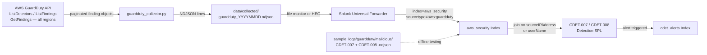

# GuardDuty Ingestion Workflow

This document describes how to collect AWS GuardDuty findings across all enabled regions,
ingest them into Splunk, and correlate them with Cloud Detection (CDET) alert rules.

---

## 1. Prerequisites

### AWS Credentials

The collector uses `boto3.Session()` with no arguments. Credentials must be configured via
the AWS CLI default credential chain before running.

```bash
aws configure
```

### Required IAM Permissions

| Permission | Purpose |
|---|---|
| `guardduty:ListDetectors` | Enumerate active GuardDuty detectors in each region |
| `guardduty:ListFindings` | Retrieve paginated finding IDs for a detector |
| `guardduty:GetFindings` | Fetch full finding objects by ID (up to 50 per call) |

Minimum inline policy:

```json
{
  "Version": "2012-10-17",
  "Statement": [
    {
      "Effect": "Allow",
      "Action": [
        "guardduty:ListDetectors",
        "guardduty:ListFindings",
        "guardduty:GetFindings"
      ],
      "Resource": "*"
    }
  ]
}
```

GuardDuty must be enabled in at least one region. The collector automatically iterates all
regions returned by `ec2:DescribeRegions` and skips regions with no active detector.

---

## 2. Collector Execution

```bash
python scripts/aws_collectors/collect_cli.py --service guardduty
```

Output is written to:

```
data/collected/guardduty_YYYYMMDD.ndjson
```

Each line is one GuardDuty finding object as returned by `GetFindings`. Findings from all
enabled regions are combined into the single daily NDJSON file. A `_collector_region` field
is injected by the collector to preserve provenance.

---

## 3. GuardDuty Finding Schema

Key fields present in every GuardDuty finding:

| Field | Type | Description |
|---|---|---|
| `id` | string | Unique finding ID (UUID) |
| `type` | string | Finding type in `Category:ResourceType/ThreatFamily.Variant` format |
| `severity` | number | Float from 1.0 to 10.0 (Low: 1–3.9, Medium: 4–6.9, High: 7–8.9, Critical: 9–10) |
| `title` | string | Human-readable finding title |
| `description` | string | Detailed explanation of the threat |
| `createdAt` | string | ISO 8601 timestamp of first occurrence |
| `updatedAt` | string | ISO 8601 timestamp of last occurrence |
| `service.count` | integer | Number of times this finding has been observed |
| `service.action` | object | Action details — `networkConnectionAction`, `awsApiCallAction`, or `portProbeAction` |
| `service.action.awsApiCallAction.api` | string | The AWS API called (for API-based findings) |
| `service.action.networkConnectionAction.remoteIpDetails` | object | Source IP, country, organisation |
| `resource.instanceDetails` | object | EC2 instance metadata (for instance-based findings) |
| `resource.accessKeyDetails` | object | IAM access key and user metadata (for IAM findings) |
| `accountId` | string | AWS account ID where the finding occurred |
| `region` | string | AWS region of the finding |

---

## 4. Finding Types That Correlate with CDETs

### CDET-007 — Instance Credential Exfiltration

**GuardDuty finding type:**
`UnauthorizedAccess:IAMUser/InstanceCredentialExfiltration.OutsideAWS`

This finding fires when EC2 instance profile credentials are used from an IP address outside
AWS infrastructure, which strongly indicates the credentials were exfiltrated and are being
used by an attacker.

Correlation: GuardDuty `resource.accessKeyDetails.userName` matches the principal in a
CDET-007 CloudTrail alert. The GuardDuty finding provides geolocation and ISP context for
the external IP that the CloudTrail event alone does not carry.

### CDET-008 — Reconnaissance Activity

**GuardDuty finding types:**

- `Recon:EC2/PortProbeUnprotectedPort` — external actor probing open ports on an EC2
  instance; indicates target enumeration prior to exploitation.
- `Recon:IAMUser/MaliciousIPCaller` — API calls from an IAM user originating from a known
  malicious IP address; indicates attacker-controlled credential use during reconnaissance.

Correlation: GuardDuty `service.action.networkConnectionAction.remoteIpDetails.ipAddressV4`
or `resource.accessKeyDetails.userName` can be joined to CDET-008 CloudTrail alerts on
`sourceIPAddress` or `userIdentity.userName`.

---

## 5. Sample Finding

The following is a fictional sample finding for
`UnauthorizedAccess:IAMUser/InstanceCredentialExfiltration.OutsideAWS`:

```json
{
  "accountId": "123456789012",
  "region": "us-east-1",
  "id": "7ab1234567890abcdef1234567890abc",
  "type": "UnauthorizedAccess:IAMUser/InstanceCredentialExfiltration.OutsideAWS",
  "title": "Credentials for instance role arn:aws:iam::123456789012:role/WebServerRole used from external IP",
  "description": "AWS CloudTrail logged API calls using credentials obtained from EC2 instance i-0abc1234def567890. The calls originated from IP address 203.0.113.88, which is outside AWS IP address space.",
  "severity": 8.0,
  "createdAt": "2024-11-15T04:12:33Z",
  "updatedAt": "2024-11-15T04:45:00Z",
  "service": {
    "count": 12,
    "detector_id": "a1b2c3d4e5f6a1b2c3d4e5f6a1b2c3d4",
    "action": {
      "actionType": "AWS_API_CALL",
      "awsApiCallAction": {
        "api": "GetCallerIdentity",
        "serviceName": "sts.amazonaws.com",
        "callerType": "Remote IP",
        "remoteIpDetails": {
          "ipAddressV4": "203.0.113.88",
          "country": { "countryName": "Romania" },
          "organization": { "asn": "AS64496", "asnOrg": "Example Hosting Provider" },
          "geoLocation": { "lat": 44.4325, "lon": 26.1039 }
        }
      }
    }
  },
  "resource": {
    "resourceType": "AccessKey",
    "accessKeyDetails": {
      "accessKeyId": "ASIAEXAMPLEKEY12345",
      "principalId": "AROAEXAMPLEROLEID",
      "userType": "AssumedRole",
      "userName": "WebServerRole"
    },
    "instanceDetails": {
      "instanceId": "i-0abc1234def567890",
      "instanceType": "t3.medium",
      "launchTime": "2024-11-01T10:00:00Z",
      "tags": [
        { "key": "Name", "value": "prod-web-01" },
        { "key": "Environment", "value": "production" }
      ]
    }
  },
  "_collector_region": "us-east-1"
}
```

---

## 6. Splunk Ingestion Target

| Field | Value |
|---|---|
| `index` | `aws_security` |
| `sourcetype` | `aws:guardduty` |
| Timestamp field | `createdAt` |
| Time format | `%Y-%m-%dT%H:%M:%SZ` |

### Universal Forwarder Configuration

```ini
[monitor://C:\Users\Umer\Downloads\CloudThreatDetectionLab\data\collected\guardduty_*.ndjson]
index       = aws_security
sourcetype  = aws:guardduty
host        = cloud-threat-lab
```

### HEC Ingestion

```bash
TOKEN="<your-hec-token>"
HEC_URL="https://<splunk-host>:8088/services/collector/event"

while IFS= read -r line; do
  curl -s -o /dev/null \
    -H "Authorization: Splunk $TOKEN" \
    -H "Content-Type: application/json" \
    -d "{\"index\":\"aws_security\",\"sourcetype\":\"aws:guardduty\",\"event\":$line}" \
    "$HEC_URL"
done < data/collected/guardduty_$(date +%Y%m%d).ndjson
```

---

## 7. Using Sample Data Offline

The repository includes two pre-built GuardDuty NDJSON files under
`sample_logs/guardduty/malicious/`:

| File | CDET | Contents |
|---|---|---|
| `CDET-007_instance_credential_exfiltration.ndjson` | CDET-007 | Findings of type `UnauthorizedAccess:IAMUser/InstanceCredentialExfiltration.OutsideAWS` with external IP and access key details |
| `CDET-008_recon_ec2_describe_instances.ndjson` | CDET-008 | Findings of type `Recon:EC2/PortProbeUnprotectedPort` and `Recon:IAMUser/MaliciousIPCaller` |

Load both files into Splunk for offline detection testing:

```ini
[monitor://C:\Users\Umer\Downloads\CloudThreatDetectionLab\sample_logs\guardduty\malicious\]
index       = aws_security
sourcetype  = aws:guardduty
```

After ingestion, run the CDET-007 and CDET-008 detection SPL searches against
`index=aws_security sourcetype="aws:guardduty"` to confirm the sample data triggers the
expected alerts.

---

## 8. Pipeline Flowchart


