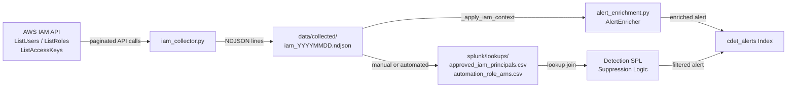

# IAM Ingestion Workflow

This document describes how the IAM collector captures a baseline snapshot of IAM state,
how that data feeds the `alert_enrichment.py` enricher, and how it populates the Splunk
lookup CSVs used by detection suppression logic.

---

## 1. Prerequisites

### AWS Credentials

The collector uses `boto3.Session()` with no arguments. Credentials must be configured via
the AWS CLI default credential chain before running.

```bash
aws configure
```

### Required IAM Permissions

| Permission | Purpose |
|---|---|
| `iam:GetUser` | Fetch metadata for individual IAM users |
| `iam:ListUsers` | Enumerate all IAM users in the account |
| `iam:ListRoles` | Enumerate all IAM roles |
| `iam:ListAccessKeys` | List access key IDs and status for each user |
| `iam:ListAttachedUserPolicies` | Identify managed policies attached to each user |

Minimum inline policy:

```json
{
  "Version": "2012-10-17",
  "Statement": [
    {
      "Effect": "Allow",
      "Action": [
        "iam:GetUser",
        "iam:ListUsers",
        "iam:ListRoles",
        "iam:ListAccessKeys",
        "iam:ListAttachedUserPolicies"
      ],
      "Resource": "*"
    }
  ]
}
```

---

## 2. Collector Execution

```bash
python scripts/aws_collectors/collect_cli.py --service iam
```

Output is written to:

```
data/collected/iam_YYYYMMDD.ndjson
```

Each line is one IAM resource record (user, role, or access key). The `resource_type` field
distinguishes record types: `iam_user`, `iam_role`, `iam_access_key`.

---

## 3. Purpose: IAM Baseline

The IAM collector serves two distinct downstream consumers:

1. **`alert_enrichment.py`** — enriches in-flight alerts at detection time with live IAM
   context about the principal involved.
2. **Splunk lookup CSVs** — provide static reference tables that detection SPL uses to
   suppress known-good principals and automation roles.

Running the collector on a regular schedule (e.g., daily via cron or Task Scheduler) keeps
both consumers current with the actual IAM state of the account.

---

## 4. How IAM Data Feeds Alert Enrichment

`enrichment/alert_enrichment.py` contains `AlertEnricher`, which calls
`_apply_iam_context()` for each alert before it is written to `cdet_alerts`.

For every alert that carries a `principal_arn` or `user_name` field, `_apply_iam_context()`
makes the following live IAM API calls:

| API call | Data added to alert |
|---|---|
| `iam.get_user(UserName=...)` | `user_create_date`, `user_path`, `password_last_used` |
| `iam.list_mfa_devices(UserName=...)` | `mfa_enabled` (bool), `mfa_device_count` |
| `iam.list_attached_user_policies(UserName=...)` | `attached_policy_arns` list |

The enriched alert then contains enough context for an analyst to assess privilege level and
MFA posture without pivoting to the AWS console.

Example enriched alert fragment:

```json
{
  "cdet_id": "CDET-001",
  "principal_arn": "arn:aws:iam::123456789012:user/attacker-user",
  "iam_enrichment": {
    "user_create_date": "2024-10-01T09:00:00Z",
    "password_last_used": "2024-11-14T22:10:00Z",
    "mfa_enabled": false,
    "mfa_device_count": 0,
    "attached_policy_arns": [
      "arn:aws:iam::aws:policy/AdministratorAccess"
    ]
  }
}
```

---

## 5. How IAM Data Feeds Splunk Lookups

Detection SPL queries reference two lookup tables to suppress alerts for known-good
principals and automation roles. These CSVs live in `splunk/lookups/` and are uploaded to
the Splunk search head.

### Populating the CSVs

**Manual population** — after running the IAM collector, review `data/collected/iam_YYYYMMDD.ndjson`
and add approved principals and automation roles to the respective CSV files by hand.

**Automated population** — parse the NDJSON output and append new principals:

```bash
python scripts/aws_collectors/collect_cli.py --service iam
# Then run your lookup population script, for example:
python scripts/populate_lookups.py \
  --input data/collected/iam_$(date +%Y%m%d).ndjson \
  --lookups splunk/lookups/
```

---

## 6. Lookup CSV Schemas

### `splunk/lookups/approved_iam_principals.csv`

Used by detection SPL to exclude known-good principals from triggering alerts.

| Column | Type | Description |
|---|---|---|
| `principal_arn` | string | Full ARN of the IAM user or role |
| `principal_type` | string | `IAMUser` or `AssumedRole` |
| `owner` | string | Team or person responsible for this principal |
| `last_reviewed` | date (YYYY-MM-DD) | Date the principal was last reviewed for access |

Example rows:

```csv
principal_arn,principal_type,owner,last_reviewed
arn:aws:iam::123456789012:user/ci-deploy,IAMUser,platform-team,2024-10-15
arn:aws:iam::123456789012:role/ReadOnlyAccess,AssumedRole,security-team,2024-11-01
```

### `splunk/lookups/automation_role_arns.csv`

Used by detection SPL to suppress alerts generated by known automation roles (e.g., Lambda
execution roles, CI/CD roles) that legitimately perform high-value API calls.

| Column | Type | Description |
|---|---|---|
| `role_arn` | string | Full ARN of the automation IAM role |
| `role_name` | string | Short name of the role |
| `use_case` | string | Description of what the automation does |

Example rows:

```csv
role_arn,role_name,use_case
arn:aws:iam::123456789012:role/LambdaExecutionRole,LambdaExecutionRole,Serverless function execution - CloudWatch Logs write
arn:aws:iam::123456789012:role/GithubActionsDeployRole,GithubActionsDeployRole,CI/CD pipeline - S3 deploy and CloudFormation updates
```

### Uploading Lookups to Splunk

```bash
# Via Splunk REST API
curl -k -u admin:<password> \
  https://<splunk-host>:8089/servicesNS/admin/search/data/lookup-table-files \
  -F "output_mode=json" \
  -F "name=approved_iam_principals.csv" \
  -F "eai:data=@splunk/lookups/approved_iam_principals.csv"
```

---

## 7. Pipeline Flowchart


