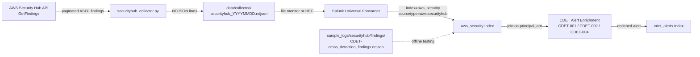

# SecurityHub Ingestion Workflow

This document describes how to collect AWS Security Hub findings in ASFF format, ingest
them into Splunk, and correlate them with Cloud Detection (CDET) alerts.

---

## 1. Prerequisites

### AWS Credentials

The collector uses `boto3.Session()` with no arguments. Credentials must be configured via
the AWS CLI default credential chain before running.

```bash
aws configure
```

### Required IAM Permissions

| Permission | Purpose |
|---|---|
| `securityhub:GetFindings` | Retrieve paginated finding results |
| `securityhub:ListFindingAggregators` | Identify aggregator regions for multi-region deployments |

Minimum inline policy:

```json
{
  "Version": "2012-10-17",
  "Statement": [
    {
      "Effect": "Allow",
      "Action": [
        "securityhub:GetFindings",
        "securityhub:ListFindingAggregators"
      ],
      "Resource": "*"
    }
  ]
}
```

Security Hub must be enabled in the target region(s). If a finding aggregator is configured,
the collector will query the aggregator region and retrieve findings from all linked regions
in a single pass.

---

## 2. Collector Execution

```bash
python scripts/aws_collectors/collect_cli.py --service securityhub
```

Output is written to:

```
data/collected/securityhub_YYYYMMDD.ndjson
```

Each line is one ASFF finding object as returned by the `GetFindings` API.

---

## 3. ASFF Schema Overview

Security Hub uses the **Amazon Security Finding Format (ASFF)** as a normalised schema
across all integrated services (GuardDuty, Inspector, Macie, partner products, and custom
findings).

Key top-level fields relevant to detection and triage:

| Field | Type | Description |
|---|---|---|
| `Id` | string | Globally unique finding ARN |
| `Title` | string | Human-readable summary of the finding |
| `Description` | string | Detailed description of the issue |
| `Severity.Label` | string | `INFORMATIONAL`, `LOW`, `MEDIUM`, `HIGH`, or `CRITICAL` |
| `Resources[]` | array | AWS resources implicated in the finding |
| `Resources[].Type` | string | Resource type, e.g., `AwsIamUser`, `AwsEc2Instance` |
| `Resources[].Id` | string | ARN or identifier of the resource |
| `Compliance.Status` | string | `PASSED`, `FAILED`, `NOT_AVAILABLE`, `WARNING` |
| `RecordState` | string | `ACTIVE` or `ARCHIVED` |
| `WorkflowState` | string | `NEW`, `NOTIFIED`, `RESOLVED`, `SUPPRESSED` |
| `CreatedAt` | string | ISO 8601 timestamp when the finding was created |
| `UpdatedAt` | string | ISO 8601 timestamp of last update |
| `ProductArn` | string | ARN of the product that generated the finding |
| `AwsAccountId` | string | Account ID where the finding occurred |

---

## 4. Sample ASFF Finding

```json
{
  "SchemaVersion": "2018-10-08",
  "Id": "arn:aws:securityhub:us-east-1:123456789012:subscription/aws-foundational-security-best-practices/v/1.0.0/IAM.1/finding/abc123def456",
  "ProductArn": "arn:aws:securityhub:us-east-1::product/aws/securityhub",
  "GeneratorId": "aws-foundational-security-best-practices/v/1.0.0/IAM.1",
  "AwsAccountId": "123456789012",
  "Types": ["Software and Configuration Checks/Industry and Regulatory Standards/AWS-Foundational-Security-Best-Practices"],
  "CreatedAt": "2024-11-15T03:00:00Z",
  "UpdatedAt": "2024-11-15T03:00:00Z",
  "Severity": {
    "Label": "MEDIUM",
    "Normalized": 40
  },
  "Title": "IAM.1 IAM policies should not allow full \"*\" administrative privileges",
  "Description": "This control checks whether the default version of IAM policies allows administrators to gain full access. The control fails if any statement in the policy has Effect Allow with Action * over Resource *.",
  "Remediation": {
    "Recommendation": {
      "Text": "Remove statements that grant full administrative access. Apply least-privilege policies.",
      "Url": "https://docs.aws.amazon.com/securityhub/latest/userguide/iam-controls.html#iam-1"
    }
  },
  "Resources": [
    {
      "Type": "AwsIamUser",
      "Id": "arn:aws:iam::123456789012:user/attacker-user",
      "Partition": "aws",
      "Region": "us-east-1",
      "Details": {
        "AwsIamUser": {
          "UserName": "attacker-user",
          "UserId": "AIDAEXAMPLEID12345678",
          "CreateDate": "2024-10-01T09:00:00Z",
          "AttachedManagedPolicies": [
            {
              "PolicyName": "AdministratorAccess",
              "PolicyArn": "arn:aws:iam::aws:policy/AdministratorAccess"
            }
          ]
        }
      }
    }
  ],
  "Compliance": {
    "Status": "FAILED"
  },
  "RecordState": "ACTIVE",
  "WorkflowState": "NEW",
  "FindingProviderFields": {
    "Severity": {
      "Label": "MEDIUM"
    }
  }
}
```

---

## 5. Splunk Ingestion Target

| Field | Value |
|---|---|
| `index` | `aws_security` |
| `sourcetype` | `aws:securityhub` |
| Timestamp field | `CreatedAt` |
| Time format | `%Y-%m-%dT%H:%M:%SZ` |

### Universal Forwarder Configuration

```ini
[monitor://C:\Users\Umer\Downloads\CloudThreatDetectionLab\data\collected\securityhub_*.ndjson]
index       = aws_security
sourcetype  = aws:securityhub
host        = cloud-threat-lab
```

### HEC Ingestion

```bash
TOKEN="<your-hec-token>"
HEC_URL="https://<splunk-host>:8088/services/collector/event"

while IFS= read -r line; do
  curl -s -o /dev/null \
    -H "Authorization: Splunk $TOKEN" \
    -H "Content-Type: application/json" \
    -d "{\"index\":\"aws_security\",\"sourcetype\":\"aws:securityhub\",\"event\":$line}" \
    "$HEC_URL"
done < data/collected/securityhub_$(date +%Y%m%d).ndjson
```

---

## 6. Correlation with CDET Alerts

Security Hub findings that involve IAM user resources can directly enrich or cross-correlate
with CDET detection rules that operate on `index=aws_cloudtrail`.

| SecurityHub Finding Type | Correlated CDETs | Correlation Field |
|---|---|---|
| `IAM.1` — Full admin policy attached | CDET-001 (privilege escalation), CDET-002 (new admin user) | `Resources[].Id` matches `userIdentity.arn` |
| `IAM.4` — Root user access key exists | CDET-004 (root account usage) | `AwsAccountId` |
| `IAM.6` — No MFA on root | CDET-004 (root account usage) | `AwsAccountId` |
| `IAM.3` — Access keys rotated >90 days | CDET-002 (persistence indicators) | `Resources[].Id` |

### SPL Cross-Index Lookup Pattern

```splunk
index=aws_cloudtrail sourcetype="aws:cloudtrail:json" eventName=CreateUser
| rename userIdentity.arn AS principal_arn
| join type=left principal_arn [
    search index=aws_security sourcetype="aws:securityhub" RecordState=ACTIVE Compliance.Status=FAILED
    | rename Resources{}.Id AS principal_arn
    | table principal_arn, Title, Severity.Label
]
| where isnotnull(Title)
| eval cdet_cross_enrichment=Title
```

---

## 7. Cross-Detection Enrichment via Sample Data

The file `sample_logs/securityhub/findings/CDET-cross_detection_findings.ndjson` contains
synthetic Security Hub findings designed to demonstrate correlation across multiple CDETs.

Each finding in this file includes a custom `Note` or `UserDefinedFields` entry that maps
the finding to one or more CDET IDs. Use this file to:

- Validate that SPL join queries correctly surface Security Hub context alongside CloudTrail
  alerts.
- Test enrichment logic in `alert_enrichment.py` without requiring a live Security Hub
  deployment.

Load the cross-detection sample into Splunk:

```ini
[monitor://C:\Users\Umer\Downloads\CloudThreatDetectionLab\sample_logs\securityhub\findings\CDET-cross_detection_findings.ndjson]
index       = aws_security
sourcetype  = aws:securityhub
```

---

## 8. Pipeline Flowchart


