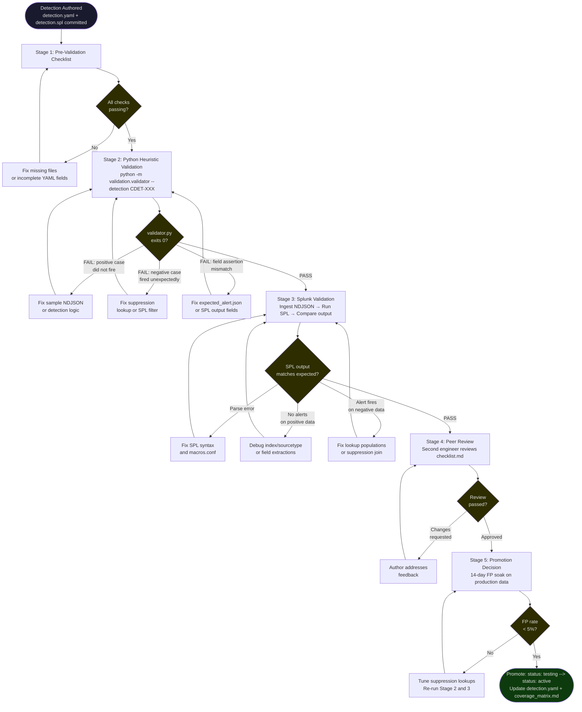

# Detection Validation Workflow

**Document:** validation/validation_workflow.md
**Version:** 1.0.0
**Date:** 2026-06-18
**Status:** Active

---

## Table of Contents

1. [Workflow Overview](#workflow-overview)
2. [End-to-End Flowchart](#end-to-end-flowchart)
3. [Stage 1: Pre-Validation Checklist](#stage-1-pre-validation-checklist)
4. [Stage 2: Python Heuristic Validation](#stage-2-python-heuristic-validation)
5. [Stage 3: Splunk Validation](#stage-3-splunk-validation)
6. [Stage 4: Peer Review](#stage-4-peer-review)
7. [Stage 5: Promotion Decision](#stage-5-promotion-decision)
8. [Rollback Procedure](#rollback-procedure)
9. [Escalation Path](#escalation-path)

---

## Workflow Overview

The table below shows every stage, the responsible party, the gate that must be passed before the next stage begins, and the artifact produced.

| Stage | Name | Owner | Entry Gate | Exit Gate | Artifact Produced |
|-------|------|-------|------------|-----------|-------------------|
| 0 | Detection Authoring | Detection Engineer | CDET-XXX ID assigned | detection.yaml and SPL committed to branch | detection.yaml, detection.spl |
| 1 | Pre-Validation Checklist | Detection Engineer | Branch exists | All pre-checks pass | Completed checklist.md |
| 2 | Python Heuristic Validation | Detection Engineer | Pre-checks green | `validator.py` exits 0 for detection | validation_run_\<ts\>.json |
| 3 | Splunk Validation | Detection Engineer | Heuristic PASS | SPL results match expected_alert.json in Splunk | Annotated Splunk screenshot or export |
| 4 | Peer Review | Reviewing Engineer | Splunk PASS evidence committed | Reviewer signs checklist.md | Signed checklist.md |
| 5 | Promotion Decision | Detection Lead | Peer review complete + FP soak done | Status updated to Active in detection.yaml | Updated detection.yaml, coverage_matrix.md entry |

All stages must be completed in order. A detection may not skip from Stage 2 directly to Stage 5. The Splunk validation step (Stage 3) is mandatory regardless of Python heuristic results because `validator.py` mirrors detection logic in a Python heuristic — it does not execute SPL and cannot catch index, macro, or lookup configuration errors.

---

## End-to-End Flowchart



---

## Stage 1: Pre-Validation Checklist

Complete every item below before running any automated or manual validation. A detection that fails any item must be fixed before advancing. Mark items with the date and your initials.

### 1.1 Detection Files

| Check | Path Pattern | Pass Criterion |
|-------|-------------|----------------|
| SPL file exists | `detections/<tactic>/CDET-XXX_<name>/detection.spl` | File is present and non-empty |
| SPL parses without errors | (verified in Stage 3) | No red parse indicator in Splunk Search bar |
| detection.yaml exists | `detections/<tactic>/CDET-XXX_<name>/detection.yaml` | File is present and non-empty |
| SPL filename referenced in YAML | `spl_file: detection.spl` in detection.yaml | Field is present and value matches actual filename |

### 1.2 detection.yaml Required Fields

All fields listed below must be present and populated. Null values or empty strings are not acceptable for required fields.

| Field | Required Value / Type | Notes |
|-------|-----------------------|-------|
| `id` | `CDET-XXX` format | Must match directory name prefix |
| `name` | Non-empty string | Human-readable title |
| `version` | Semver string (e.g. `"1.0.0"`) | Increment on every change |
| `status` | `testing` on first validation | Changed to `active` at Stage 5 |
| `created` | ISO date string | Date of first commit |
| `modified` | ISO date string | Must equal today on any change |
| `author` | Non-empty string | Team or individual name |
| `tactic` | MITRE ATT&CK tactic name | e.g. `Persistence` |
| `technique` | `TXXXX` or `TXXXX.XXX` | Must match ATT&CK framework |
| `sub_technique` | `TXXXX.XXX` or omitted | Include when applicable |
| `technique_name` | Full technique name string | Must match ATT&CK wording |
| `severity` | One of: `critical`, `high`, `medium`, `low` | |
| `confidence` | One of: `high`, `medium`, `low` | |
| `risk_score` | Integer 1–100 | |
| `data_sources` | List with at least one entry | e.g. `[cloudtrail]` |
| `splunk_index` | Non-empty string | e.g. `aws_cloudtrail` |
| `splunk_sourcetype` | Non-empty string | e.g. `aws:cloudtrail:normalized` |
| `required_fields` | List of dotted field paths | At minimum: eventName, userIdentity.arn |
| `spl_file` | Filename string | Must resolve within detection directory |
| `schedule` | Cron expression | e.g. `"*/15 * * * *"` |
| `lookback` | Splunk relative time string | e.g. `"-30m"` |
| `lookups` | List (may be empty list `[]`) | Each entry needs `name`, `description`, `file` |
| `false_positive_notes` | Multi-line string | At least one known FP scenario documented |
| `test_cases` | List with at least one entry | Positive and negative entries required |
| `playbook` | Path to IR playbook | Must exist in incident_response/playbooks/ |
| `validation.trigger_conditions` | List of strings | Human-readable fire conditions |
| `validation.expected_alert_fields` | List of field names | Must match SPL `| table` output columns |
| `validation.pass_criteria` | List of strings | Minimum: positive fires, negative suppressed |

### 1.3 Sample NDJSON Files

Sample data files reside under `sample_logs/` and are loaded by `validator.py`. Each detection must have at minimum a positive (malicious) case file. Negative and edge files are strongly recommended.

| File Type | Expected Path | Requirement |
|-----------|--------------|-------------|
| Positive (malicious) | `sample_logs/cloudtrail/malicious/CDET-XXX_<name>.ndjson` | Required |
| Negative (benign/suppressed) | `sample_logs/cloudtrail/benign/normal_<service>_activity.ndjson` | Required |
| Edge case | `sample_logs/cloudtrail/edge_cases/CDET-XXX_edge_<description>.ndjson` | Strongly recommended |
| GuardDuty correlation (if applicable) | `sample_logs/guardduty/malicious/CDET-XXX_<name>.ndjson` | Required for dual-source detections |

Verification steps:

1. Confirm each NDJSON file is valid — every line must be a self-contained JSON object. Validate with:
   ```bash
   python -c "
   import json, pathlib, sys
   path = pathlib.Path('sample_logs/cloudtrail/malicious/CDET-XXX_<name>.ndjson')
   [json.loads(line) for line in path.read_text().splitlines() if line.strip()]
   print('OK:', path.name)
   "
   ```
2. Confirm the positive NDJSON contains at least one event matching the detection trigger conditions listed in `detection.yaml`.
3. Confirm the negative NDJSON does NOT contain any events that should fire the detection (the principal ARN must be in a suppression lookup, or the event must be a benign action).

### 1.4 expected_alert.json

Located at `validation/test_cases/CDET-XXX_<name>/expected_alert.json`. This file defines the alert schema that both `validator.py` and the manual Splunk comparison use.

Required fields in every `expected_alert.json`:

| Field | Type | Purpose |
|-------|------|---------|
| `detection_id` | string | Exact CDET-XXX identifier |
| `alert_title` | string | Human-readable title of the alert |
| `severity` | string | One of: critical, high, medium, low |
| `urgency` | integer | Splunk urgency 1–5 (1 = highest) |
| `confidence` | string | One of: high, medium, low |
| `tactic` | string | MITRE ATT&CK tactic |
| `technique` | string | MITRE ATT&CK technique ID |
| `technique_name` | string | Full MITRE technique name |
| `principal_arn` | string | The ARN of the acting principal (sample value) |
| `event_source_ip` | string | Source IP from the CloudTrail event |
| `region` | string | AWS region of the event |
| `_time` | string | ISO 8601 timestamp from the event |

Additional detection-specific fields (e.g. `new_user_name`, `policy_arn`, `target_account_id`) must also be present. These are validated by `validator.py` via `FieldAssertion` objects built from the JSON keys.

### 1.5 Lookup CSV Files

All suppression lookups referenced in `detection.yaml` under the `lookups:` block must be populated before validation begins. Validation against empty lookup files is invalid — it will cause false negative test failures when the suppression lookup does not match.

| Lookup File | Purpose | Minimum Rows |
|-------------|---------|--------------|
| `splunk/lookups/approved_iam_principals.csv` | IAM ARNs for approved provisioning pipelines | At least the 4 automation roles used in sample data |
| `splunk/lookups/automation_role_arns.csv` | CI/CD and automation roles excluded from identity detections | At least DeploymentPipelineRole and TerraformExecutionRole |
| `splunk/lookups/admin_policy_arns.csv` | High-privilege managed policy ARNs | AdministratorAccess, PowerUserAccess, IAMFullAccess |
| `splunk/lookups/approved_aws_accounts.csv` | Trusted internal AWS account IDs | All production account IDs |
| `splunk/lookups/cloudtrail_log_buckets.csv` | S3 bucket names containing CloudTrail logs | Both primary and secondary log buckets |

To verify a lookup file is non-empty and has the expected header:

```bash
python -c "
import csv, pathlib
p = pathlib.Path('splunk/lookups/approved_iam_principals.csv')
rows = list(csv.DictReader(p.read_text().splitlines()))
print(f'{p.name}: {len(rows)} rows, columns: {list(rows[0].keys()) if rows else \"EMPTY\"}')"
```

---

## Stage 2: Python Heuristic Validation

`validation/validator.py` loads NDJSON sample data, evaluates events through a Python mirror of the detection logic, and compares the output against `expected_alert.json`. It is the fastest feedback loop — run it locally before any Splunk work.

### 2.1 Command Syntax

Run a single detection:

```bash
# From the repository root
python -m validation.validator --detection CDET-001
```

Run all detections:

```bash
python -m validation.validator --all
```

Run all detections and save a timestamped JSON report:

```bash
python -m validation.validator --all --output-dir data/validation_results/
```

The `--output-dir` flag accepts paths relative to the repository root. The report filename is `validation_run_YYYYMMDDTHHMMSS.json`.

### 2.2 Interpreting PASS/FAIL Output

The runner prints one line per test case to stdout, then a promotion-readiness summary per detection. A full all-pass run looks like:

```
  ✓ CDET-001 — positive case: PASS
  ✓ CDET-001 — negative case (suppression): PASS
  └─ CDET-001: ✓ Ready for promotion

  ✓ CDET-002 — positive case: PASS
  ✓ CDET-002 — negative case (suppression): PASS
  └─ CDET-002: ✓ Ready for promotion

============================================================
Validation Run a1b2c3d4
Tested: 14  Passed: 14  Failed: 0
Coverage: 100.0%
============================================================

Report written to: data/validation_results/validation_run_20260618T120000.json
```

The process exits with code `0` when all detections pass, and `1` when any detection fails. Use the exit code in CI pipelines.

A detection summary shows `✗ Not ready for promotion` when either the positive or negative result is missing or failed. Both are mandatory per the `ready_for_promotion` property in `validation/schema.py`.

### 2.3 Common Failure Reasons and Remediation

| Failure Message | Root Cause | Remediation |
|----------------|-----------|-------------|
| `Sample file not found: sample_logs/cloudtrail/malicious/CDET-XXX_*.ndjson` | Positive NDJSON file absent or named incorrectly | Create the NDJSON file at the expected path or rename it to match the pattern in `_find_sample_file()` |
| `Expected detection to fire but got 0 alerts from N events` | Positive sample data does not contain the trigger event, or heuristic logic does not match | Verify the NDJSON contains the correct `eventName` and `userIdentity` fields; cross-reference with `_run_heuristic_detection()` |
| `Expected NO alerts but got N (suppression may be incomplete)` | Negative sample data contains a principal that is not in the suppression set used by `_run_heuristic_detection()` | Ensure the benign NDJSON uses one of the four suppressed ARNs: `DeploymentPipelineRole`, `TerraformExecutionRole`, `AutoScalingRole`, or `SecurityAuditRole` |
| `Field 'severity' expected='high' got='critical'` | `expected_alert.json` severity does not match the severity the heuristic assigns | Fix `expected_alert.json` to match the correct severity, or fix the detection logic if the severity value is wrong |
| `Missing required field: principal_arn` | Alert dict produced by heuristic does not include `principal_arn` | This indicates a bug in the sample event — `userIdentity.arn` or `userIdentity.principalId` must be present in the NDJSON |
| `Field 'urgency' expected=1 got=2` | Urgency mismatch between `expected_alert.json` and heuristic | Align `expected_alert.json` urgency with the detection's defined severity-urgency mapping (critical=1, high=2, medium=3, low=4) |
| SKIP result for positive case | Sample file resolves to path that does not exist on disk | Run `python -m validation.validator --detection CDET-XXX` with `--output-dir` and inspect the `errors` array in the JSON report |

For aggregate-based detections (CDET-008, CDET-010), the heuristic requires the NDJSON to contain a sufficient event volume to cross the threshold (50+ read-only API calls with 5+ distinct event names for CDET-008; 100+ estimated object deletions for CDET-010). If the positive test fails, ensure the sample file contains enough events.

---

## Stage 3: Splunk Validation

Splunk validation confirms that the actual SPL query runs correctly against indexed sample data, produces the expected output fields, and correctly suppresses noise. It must be performed in an isolated Splunk test instance or a dedicated test index, not against production data.

### 3.1 Ingesting Sample NDJSON into Splunk

#### Option A: inputs.conf (Recommended for Repeatable Testing)

Create a file-based monitor stanza for the sample data directory. This approach is reproducible and version-controlled.

1. On the Splunk forwarder or search head, add the following stanza to `$SPLUNK_HOME/etc/system/local/inputs.conf`:

   ```ini
   [monitor://C:\Users\Umer\Downloads\CloudThreatDetectionLab\sample_logs\cloudtrail\malicious]
   disabled = false
   index = aws_cloudtrail_test
   sourcetype = aws:cloudtrail:normalized
   recursive = true
   whitelist = \.ndjson$
   ```

   Replace `aws_cloudtrail_test` with the name of your isolated test index. Do not target the production `aws_cloudtrail` index.

2. Restart Splunk or run `$SPLUNK_HOME/bin/splunk reload deploy-server` to pick up the new stanza.

3. Confirm ingestion via:
   ```
   index=aws_cloudtrail_test | stats count by sourcetype
   ```

#### Option B: Manual Upload via Splunk Web

1. Navigate to **Settings > Add Data > Monitor > Files & Directories**.
2. Set **Source type** to `aws:cloudtrail:normalized`.
3. Set **Index** to `aws_cloudtrail_test`.
4. Select the NDJSON file path, e.g.:
   `sample_logs/cloudtrail/malicious/CDET-001_iam_user_created_outside_pipeline.ndjson`
5. Click **Review** then **Submit**.

#### Option C: `splunk add oneshot` (CLI)

```bash
$SPLUNK_HOME/bin/splunk add oneshot \
  "C:\Users\Umer\Downloads\CloudThreatDetectionLab\sample_logs\cloudtrail\malicious\CDET-001_iam_user_created_outside_pipeline.ndjson" \
  -index aws_cloudtrail_test \
  -sourcetype aws:cloudtrail:normalized
```

After ingestion, verify the event count before running the detection:

```
index=aws_cloudtrail_test sourcetype="aws:cloudtrail:normalized"
| stats count by eventName
```

### 3.2 Running the SPL Detection Manually

1. Open Splunk Search & Reporting.
2. Open the detection SPL file from the repository: `detections/<tactic>/CDET-XXX_<name>/detection.spl`.
3. Paste the SPL into the search bar.
4. Replace the index name in the SPL `index=` clause with `aws_cloudtrail_test` if the query targets a different index.
5. Set the time range to cover the timestamps in your NDJSON sample data (or use **All Time** for test data).
6. Click **Search**.

Confirm the SPL runs without a red parse error indicator. If the query uses macros (e.g. `` `cloudtrail_index` ``), verify those macros are defined in `$SPLUNK_HOME/etc/system/local/macros.conf` and resolve to the test index.

### 3.3 Comparing Results to expected_alert.json

After the positive case SPL run completes:

1. Inspect the results table. Each column must correspond to a field listed in `validation/test_cases/CDET-XXX_<name>/expected_alert.json`.
2. For each field in `expected_alert.json`, verify:

   | expected_alert.json field | Verification |
   |--------------------------|-------------|
   | `detection_id` | Column `detection_id` present, value = `CDET-XXX` |
   | `severity` | Column `severity` present, value matches (critical/high/medium/low) |
   | `urgency` | Column `urgency` present, value is integer 1–5 |
   | `tactic` | Column `tactic` present, value matches MITRE tactic name |
   | `technique` | Column `technique` present, value matches TXXXX.XXX |
   | `technique_name` | Column `technique_name` present and non-empty |
   | `principal_arn` | Column `principal_arn` present, value is a valid IAM ARN |
   | `event_source_ip` | Column `event_source_ip` present and non-empty |
   | `region` | Column `region` present and non-empty |
   | detection-specific fields | All additional fields from expected_alert.json are present |

3. Export the results as CSV or JSON and save to `data/validation_results/CDET-XXX_splunk_positive_result.json` for evidence.

### 3.4 Verifying Suppression (Negative Test)

1. Load the benign/negative NDJSON into the test index using the same method as 3.1, but from `sample_logs/cloudtrail/benign/`.

   Example for identity detections:
   ```bash
   $SPLUNK_HOME/bin/splunk add oneshot \
     "C:\Users\Umer\Downloads\CloudThreatDetectionLab\sample_logs\cloudtrail\benign\normal_iam_activity.ndjson" \
     -index aws_cloudtrail_test \
     -sourcetype aws:cloudtrail:normalized
   ```

2. Re-run the SPL detection. The results table must return **zero rows**.

3. If rows are returned, inspect the `principal_arn` column in those results and cross-reference with the lookup CSV files in `splunk/lookups/`. The suppressing principal must be listed in the relevant lookup with the correct column value.

4. To debug a suppression miss, run the lookup portion of the SPL in isolation:
   ```
   | inputlookup approved_iam_principals.csv
   | where principal_arn="<arn from alert>"
   ```
   If this returns zero rows, the lookup is not populated with the suppressed principal. Add the ARN to the CSV, restart Splunk, and re-run the detection.

5. Document the result (zero rows confirmed) in the checklist under **Negative Test**.

### 3.5 Splunk Evidence to Commit

After completing Stages 3.3 and 3.4, commit or attach the following artifacts:

- `data/validation_results/CDET-XXX_splunk_positive_result.json` — SPL output for positive case
- `data/validation_results/CDET-XXX_splunk_negative_result.json` — SPL output (zero rows) for negative case
- The `checklist.md` for the detection, with all Splunk boxes checked and dated

---

## Stage 4: Peer Review

A second engineer must independently review every detection before it is eligible for promotion. The reviewer must not be the same person who authored the detection.

### 4.1 Peer Review Checklist

The reviewer works through `validation/test_cases/CDET-XXX_<name>/checklist.md` and verifies each item independently.

**Logic and Coverage Review**

- [ ] The SPL detection logic matches the trigger conditions stated in `detection.yaml` under `validation.trigger_conditions`
- [ ] The ATT&CK technique assignment (tactic, technique, sub-technique) is accurate for the described threat behavior
- [ ] The severity and urgency assignment is consistent with the lab's severity matrix
- [ ] The detection does not duplicate an existing Active detection without additive value
- [ ] Edge cases documented in `edge_case.md` are correctly handled (detection fires or suppresses as intended)

**Data and Field Quality Review**

- [ ] All fields in `expected_alert.json` are populated with realistic sample values (no `null` where values are expected)
- [ ] The `principal_arn` in positive sample data is clearly synthetic (e.g. `123456789012` test account)
- [ ] The positive NDJSON file contains events that would realistically appear in a CloudTrail stream
- [ ] The negative NDJSON uses a principal ARN that is genuinely in a suppression lookup, not an absent ARN

**Suppression Review**

- [ ] Suppression logic covers all legitimate automation paths documented in `false_positive_notes`
- [ ] The suppression lookup columns used in SPL (e.g. `principal_arn`) exactly match the CSV header names
- [ ] Suppression does not over-suppress — a genuine attacker using a suppressed principal name would not be missed by design (document acceptable gaps)

**Documentation Review**

- [ ] `false_positive_notes` describes at least one real-world FP scenario and its remediation path
- [ ] The detection's playbook exists at the path referenced by `playbook:` in detection.yaml
- [ ] `validation.pass_criteria` is specific enough to be objectively evaluated

### 4.2 Reviewer Sign-Off

The reviewer adds their name and date to the bottom of `checklist.md`:

```markdown
## Peer Review Sign-Off
Reviewer: <name>
Date: YYYY-MM-DD
Result: Approved / Changes Requested

Notes: <optional>
```

If changes are requested, the author addresses them and requests a re-review. The reviewer must re-check only the items that changed.

---

## Stage 5: Promotion Decision

### 5.1 Criteria for Testing to Active

All criteria in the table below must be satisfied before `status` is changed from `testing` to `active`.

| Criterion | Evidence Required | Where Documented |
|-----------|------------------|-----------------|
| Positive test passes (validator.py) | `validation_run_*.json` with PASS for CDET-XXX positive | `data/validation_results/` |
| Negative test passes (validator.py) | `validation_run_*.json` with PASS for CDET-XXX negative | `data/validation_results/` |
| SPL runs without parse errors | Splunk screenshot or exported result | `data/validation_results/` |
| SPL positive output matches expected_alert.json | Exported Splunk result JSON | `data/validation_results/` |
| SPL negative output is zero rows | Exported Splunk result JSON | `data/validation_results/` |
| All checklist.md items checked | Signed checklist.md | `validation/test_cases/CDET-XXX_*/checklist.md` |
| Peer review approved | Reviewer sign-off in checklist.md | `validation/test_cases/CDET-XXX_*/checklist.md` |
| 14-day FP soak completed | FP count and rate documented | `docs/detection_engineering/tuning_guidelines.md` or detection notes |
| FP rate < 5% | Documented FP rate | Same as above |
| Lookups fully populated | Non-empty lookup CSVs verified | `splunk/lookups/*.csv` |

### 5.2 How to Update detection.yaml Status

When all criteria are met:

1. Open `detections/<tactic>/CDET-XXX_<name>/detection.yaml`.
2. Change the `status` field:
   ```yaml
   status: active
   ```
3. Update the `modified` field to today's date:
   ```yaml
   modified: "2026-06-18"
   ```
4. Increment the `version` field (patch bump for status promotion):
   ```yaml
   version: "1.0.1"
   ```
5. Update `docs/coverage_matrix.md` — change the row for CDET-XXX from `Testing` to `Active`.
6. Commit with message format:
   ```
   promote(CDET-XXX): Testing → Active after validation and FP soak
   ```

### 5.3 Criteria for Active to Deprecated

A detection is moved from `active` to `deprecated` when any of the following conditions apply:

| Condition | Threshold | Action |
|-----------|-----------|--------|
| FP rate exceeds threshold | > 20% of alerts are false positives over 30 days | Disable scheduled search, begin tuning or deprecation review |
| Detection coverage superseded | A newer detection covers the same technique with better precision | Deprecate the older detection after confirming the replacement is Active |
| Data source decommissioned | The required CloudTrail event type or index is no longer available | Deprecate immediately and open a ticket to restore data source |
| Detection causes system performance issues | SPL query runtime > 60 seconds per scheduled run | Disable, rewrite, or deprecate depending on rewrite feasibility |
| Threat is no longer relevant | The underlying technique has been mitigated at infrastructure level | Deprecate with documented rationale |

To deprecate:

1. Set `status: deprecated` in `detection.yaml`.
2. Add a `deprecated_reason` field documenting why.
3. Disable the Splunk saved search.
4. Update `docs/coverage_matrix.md`.
5. Do not delete the detection directory — it serves as a historical record.

---

## Rollback Procedure

A detection that triggers a false positive storm (high volume of low-quality alerts causing alert fatigue or incident queue saturation) must be rolled back within one business hour of identification.

### Definition of FP Storm

A false positive storm is any of the following:

- More than 50 alerts per hour from a single detection
- More than 10 alerts for the same principal ARN within 30 minutes where all are confirmed false positives
- On-call engineer or SOC team escalates alert fatigue from a specific CDET-XXX

### Rollback Steps

**Immediate (within 15 minutes):**

1. Disable the Splunk saved search for the offending detection:
   - Navigate to **Settings > Searches, Reports, and Alerts**
   - Find the saved search named `CDET-XXX - <name>`
   - Set **Schedule** to **Disabled**

2. Notify the on-call engineer and Detection Lead via the team communication channel that CDET-XXX has been disabled due to FP storm.

3. Document the time of disable and the approximate alert count in the detection's `false_positive_notes` section.

**Short-term (within 4 hours):**

4. Identify the FP-generating principal ARN(s) by running:
   ```
   index=aws_cloudtrail sourcetype="aws:cloudtrail:normalized"
   | search detection_id="CDET-XXX"
   | stats count by principal_arn
   | sort -count
   ```

5. Add the FP principal ARN(s) to the appropriate suppression lookup CSV (`splunk/lookups/approved_iam_principals.csv` or `splunk/lookups/automation_role_arns.csv`) with:
   - `principal_arn`: the offending ARN
   - `reason`: a brief explanation (e.g. "Auto-added during FP storm 2026-06-18")
   - `expiry_date`: 30 days from today (for temporary suppression)

6. Re-run Stage 2 (validator.py negative test) to confirm the lookup suppresses the FP ARN.

7. Re-run Stage 3 (Splunk validation) with the updated lookup to confirm suppression.

**Re-enablement (after tuning):**

8. After Stages 2 and 3 pass with the new suppression, re-enable the saved search:
   - Navigate to **Settings > Searches, Reports, and Alerts**
   - Re-enable the schedule

9. Monitor for 2 hours after re-enablement to confirm the FP rate is below 5%.

10. If permanent suppression was added, update `detection.yaml` `false_positive_notes` and increment `version`.

11. Re-run Stage 4 (peer review) for the suppression change before closing the FP storm incident.

> **Git history note:** Never force-push or amend a commit to hide that a FP storm occurred. The rollback and re-tuning commits must be visible in git history as evidence of the detection lifecycle.

---

## Escalation Path

| Situation | First Contact | Escalation | Final Decision Authority |
|-----------|--------------|------------|--------------------------|
| Validator.py FAIL that engineer cannot resolve | Detection Engineer self-resolves | Detection Lead reviews sample data and heuristic logic | Detection Lead |
| Splunk SPL parse error or field extraction issue | Detection Engineer | Splunk Admin for platform issues; Detection Lead for logic issues | Splunk Admin (platform) / Detection Lead (logic) |
| Peer review — reviewer and author disagree on severity | Reviewer states objection in checklist.md | Detection Lead breaks the tie | Detection Lead |
| FP storm — on-call engineer needs immediate disable | On-call Engineer disables search directly (no approval needed) | Detection Lead notified within 15 minutes | On-call Engineer for immediate action; Detection Lead for re-enablement sign-off |
| FP rate between 5% and 20% after soak | Detection Engineer tunes and re-runs soak | Detection Lead reviews tuning before re-promotion | Detection Lead |
| Promotion blocked because 14-day soak cannot be completed (e.g. new environment) | Detection Engineer documents waiver rationale | Detection Lead approves shortened soak (minimum 72 hours) in writing | Detection Lead |
| Detection must be deprecated due to superseding detection | Detection Engineer opens review | Both Detection Lead and the engineer who authored the replacement sign off | Detection Lead |

**Validation sign-off authority:** The Detection Lead holds final sign-off authority for all Testing → Active promotions. The Detection Lead may delegate to a Senior Detection Engineer in writing for individual detections, but the delegation must be recorded in the promotion commit message.

---

*End of document. For questions about this workflow contact the Detection Engineering team.*
